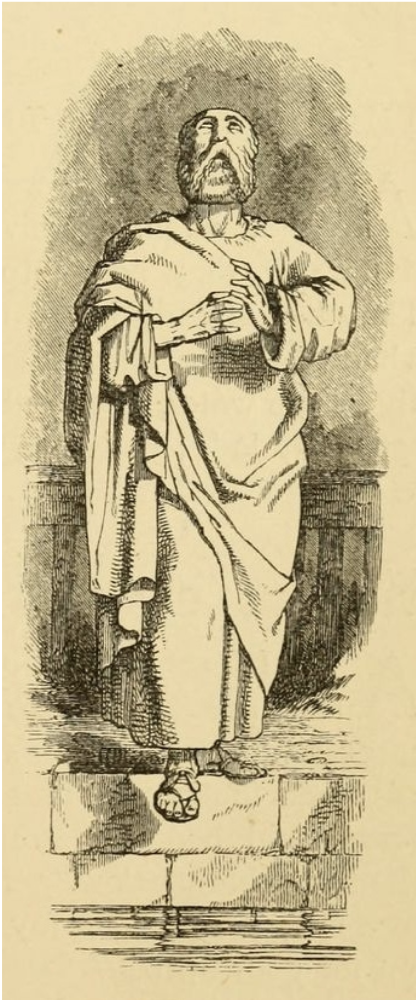
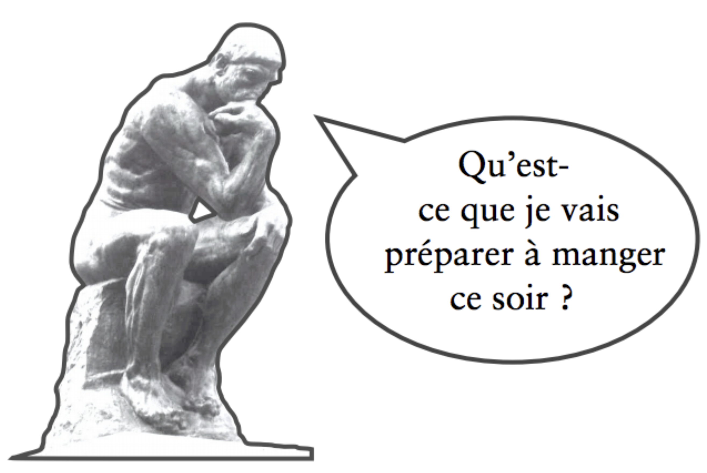
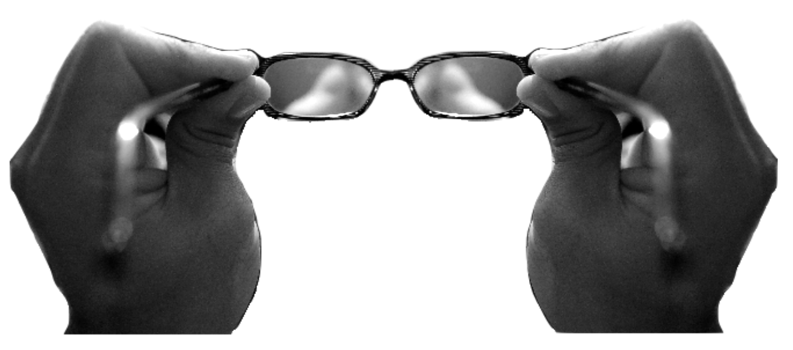
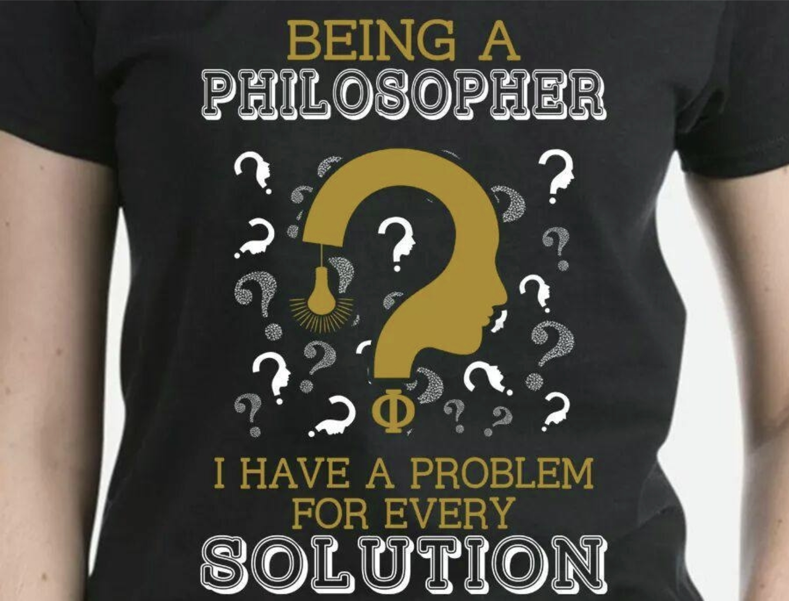
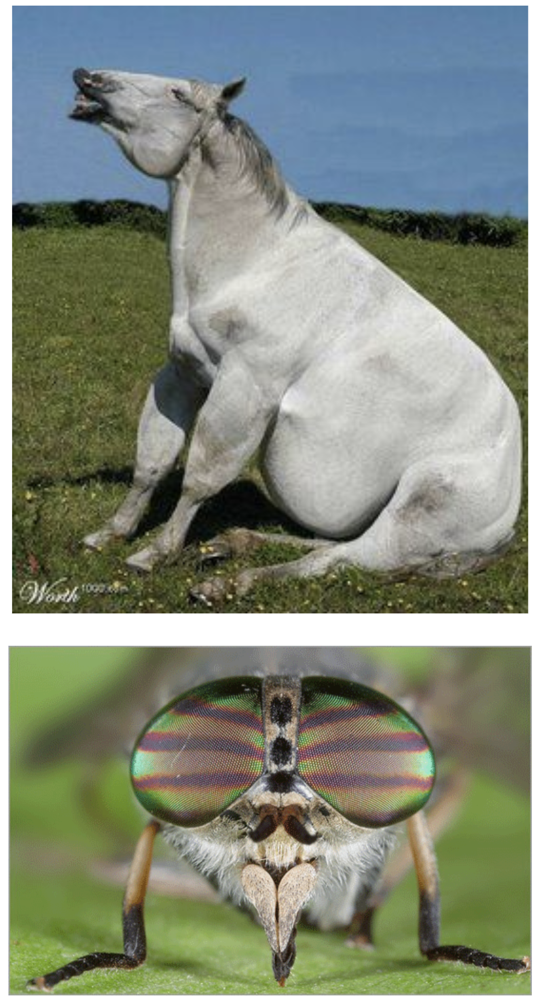

<!-- _class: titre -->

# Introduction à  la philosophie <!-- fit -->
Cédric Eyssette (2020-2021)
https://eyssette.net/

---
<!-- _class: partie -->
# I – Qu'est-ce que  la philosophie ? <!-- fit -->
Première partie

---
<!-- _class: souspartie -->
## A. Première approche <!-- fit -->

Faire de la philosophie : c'est …
Un philosophe, c'est …
La philosophie, c'est …

---
<!-- _class: i1t0 pp pm -->

---
<!-- _class: i1t1 vertical pp -->

Rembrandt, _Le philosophe en méditation_ (1632)

---
<!-- _class: pointmethode fpppppppp -->
### Point méthode
- En philosophie, c'est très utile de partie de ses représentations spontanées ou de lieux communs à propos d'une notion.
- C'est un premier matériau qu'on peut analyser, avec de l'esprit critique.

---
<!-- _class: i1t0 pp -->

Image fiche synthèse à mettre

---
<!-- _class: grille pp -->

---
<!-- _class: i1t0  pm -->

---
<!-- _class: pointmethode fpppppp -->

### Point méthode
Pour analyser une notion, on peut partir d'une approche très générale, et chercher ensuite à préciser cette approche.

  Terme technique :  « définition par genre et différence spécifique »

---
<!-- _class: fmm -->

1. La liberté n’est-elle qu’une illusion ?
2. Y a-t-il une vérité en morale ?
3. Croire en l’existence d’un dieu, est-ce rationnel ?
4. Qu’est-ce qu’une loi juste ?
5. À quoi bon travailler ?
6. Est-il possible de connaître quelque chose avec certitude ?
7. À quoi servent les artistes ?

- Qu’est-ce que ces questions ont de particulier ?
- Qu’est-ce qui distingue ces questions d’une question ordinaire comme : « quelle heure est-il ? »
- Qu’est-ce qui distingue ces questions d’une question d’une autre discipline comme : « que s’est-il passé pendant la Révolution française ? »

---
<!-- _class: souspartie -->
## B. Trois démarches essentielles

---
<!-- _class: etape -->

### 1/ Conceptualiser 

- Faire de la philosophie, c'est comme regarder ses propres lunettes : quel est le sens de cette comparaison ?

---
<!-- _class: definition -->
### Définition
- **Conceptualiser**, c'est chercher à clarifier le sens d'une notion
- Il s'agit de **définir** la notion en formulant précisément ce qu'elle est et ce qu'elle n'est pas

---
<!-- _class: i1t0 pp -->

---
<!-- _class: fmmm pm -->

- Dans les sujets de dissertation du bac 2019, quels sont les termes qu'il fallait conceptualiser ?

- **TL**
  - « Est-il possible d'échapper au temps ? »
  - « À quoi bon expliquer une oeuvre d’art ? »
- **TES**
  - « La morale est-elle la meilleure des politiques ? »
  - « Le travail divise-t-il les hommes ? »
- **TS**
  - « La pluralité des cultures fait-elle obstacle à l’unité du genre humain ? »
  - « Reconnaître ses devoirs, est-ce renoncer à sa liberté ? »
- **Technologiques**
  - « Seul ce qui peut s’échanger a-t-il de la valeur ? »
  - « Les lois peuvent-elles faire notre bonheur ? »

---
<!-- _class: pointmethode fpppppppppp-->
### Point méthode
- Les sujets de dissertation sont généralement constitués par deux notions principales
- L'un des objectifs de la dissertation est de chercher à clarifier le sens de ces notions (il faut conceptualiser)

---
<!-- _class: etape -->

### 2/ Problématiser

---
<!-- _class: definition -->
### Définition
**Problématiser**, c'est saisir la complexité et les enjeux d'une question, en montrant qu'il y a un véritable débat à ce sujet entre plusieurs réponses possibles

---
<!-- _class: i1t1 fpppppp -->

- Peut-on lancer un nain qui le veut bien ?

Martin Scorsese, _Le Loup de Wall Street_ (2013)

---
<!-- _class: fmmmmmm -->

<!-- Autres affaires juridiques mobilisables : l'affaire Lask ; l'affaire du cannibale de Rotenburg : Armin Meiwes -->

### L’affaire du “lancer de nain” en résumé

- **1990-1991** : Manuel Wackenheim participe à une soixante de “spectacles de lancer de nain” organisés par la société _Fun-Productions_
- **25 octobre 1991** : Le maire de Morsang-sur-Orge décide d’interdire ces spectacles sur sa commune, par arrêté municipal
- **25 février 1992** : Sans emploi, Manuel Wackenheim estime que cette décision est injuste et obtient l’annulation de cet arrêté devant le tribunal administratif de Versailles
- **27 octobre 1995** : Le Conseil d’État, saisi par le maire, annule le jugement du tribunal administratif de Versailles
- **16 octobre 1996** : La Cour européenne des droits de l’homme rejette la plainte de Manuel Wackenheim contre la France
- **26 juillet 2002** : Le Comité des droits de l’homme des Nations Unies rejette également la plainte de Manuel Wackenheim contre la France 

---
<!-- _class: i1t1 horizontal pp f -->

Socrate (‎470-469 avant notre ère) est un personnage fondateur pour la philosophie.
 Pour expliquer sa démarche, il se compare à un taon qui pique un cheval un peu mou.

---
<!-- _class: i1t1 horizontal contain pp -->

- Que représente le cheval un peu mou ?
- Que représente le taon qui pique ce cheval ?
- Pourquoi faire de la philosophie, c’est être comme un taon qui pique un cheval un peu mou ?
