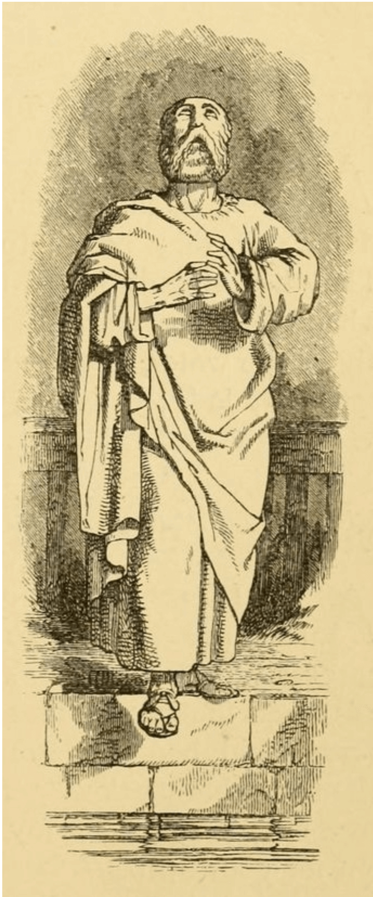
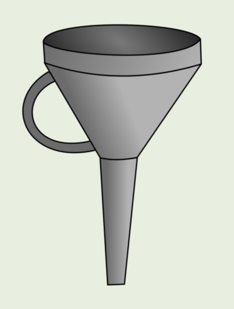
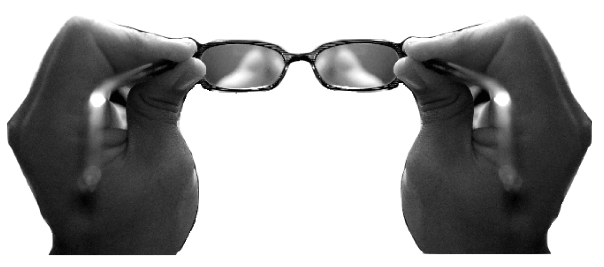
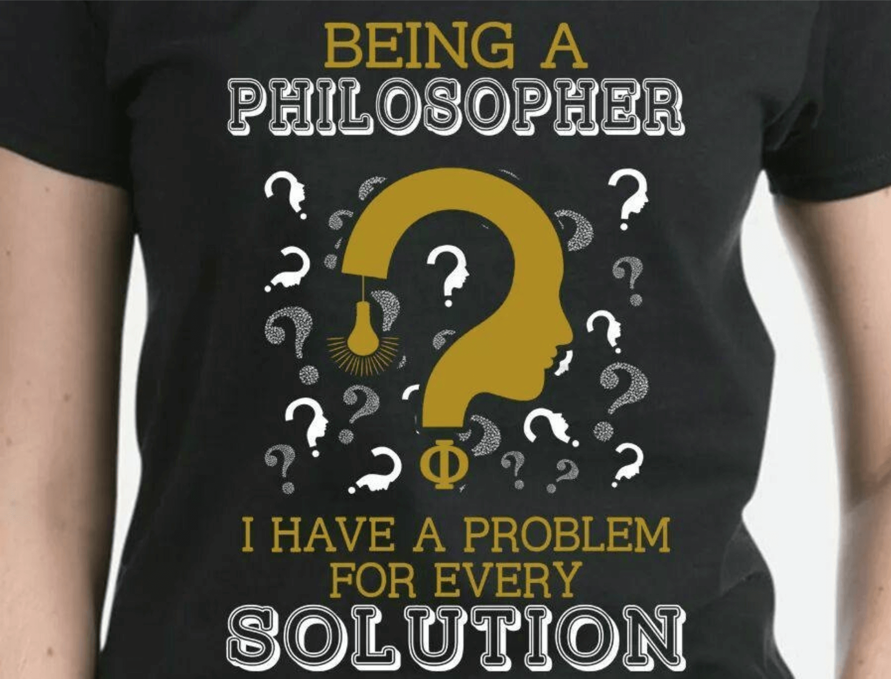
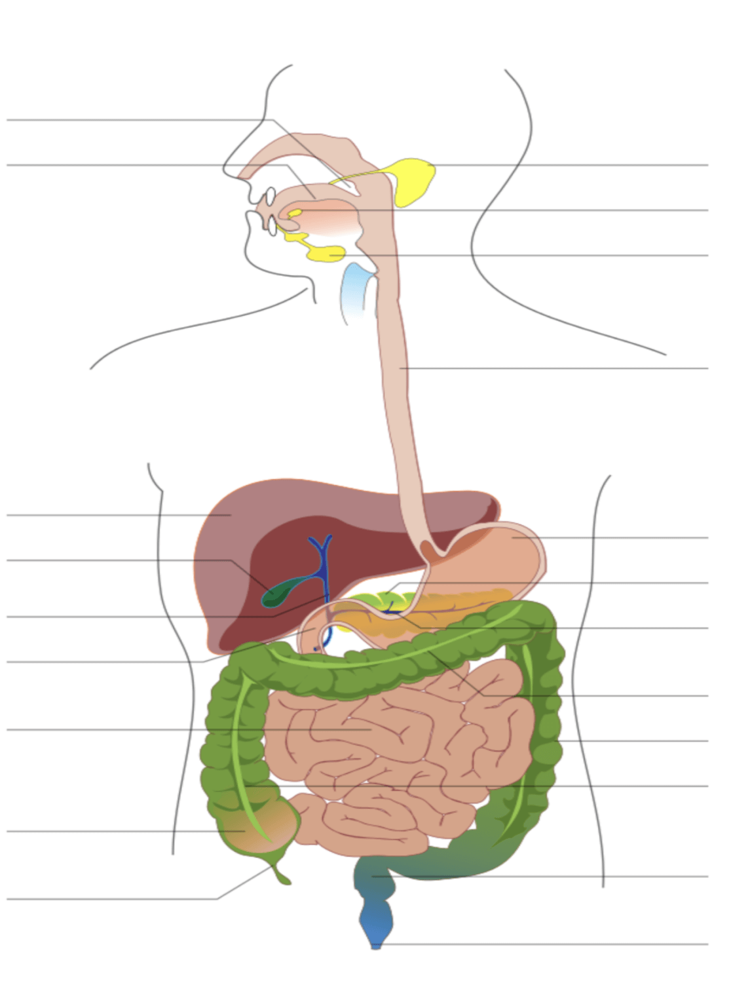

<!-- _class: titre -->

# Introduction à  la philosophie <!-- fit -->
Cédric Eyssette (2021-2022)
http://eyssette.github.io

---
<!-- _class: i1t0 pp -->

<!-- Matière nouvelle : peur, craintes / attente, excitation intellectuelle -->

---
<!-- _class: fppppppppp -->

##  :dart:   Objectifs de ce cours

1) Comprendre l'essentiel de ce qu'il faut faire en philosophie : poser les bases de la méthode :bricks: 
2) Comprendre comment on va fonctionner ensemble dans l'année :scroll: 
3)  Développer une envie de faire de la philosophie  :smiley:

---
<!-- _class:  -->

**I – Qu'est-ce que la philosophie ?**

A. Première approche
B. Trois démarches essentielles
C. Une quatrième démarche importante

**II – Le fonctionnement du cours**

A. Le cadre général
B. Les aides pour réussir en philosophie

---
<!-- _class: partie -->

# I – Qu'est-ce que  la philosophie ? <!-- fit -->
Première partie

---
<!-- _class: souspartie -->
## A. Première approche <!-- fit -->

Faire de la philosophie : c'est …
Un philosophe, c'est …
La philosophie, c'est …

---
<!-- _class: i1t0 pp -->

<!-- La philosophie semble avant tout être une activité ………(intellectuelle ≠ manuelle)………… où l’on fait usage de son …… (esprit ≠ corps)……… pour se questionner, s’interroger, penser, réfléchir.
[Interrogation sur ces distinctions] -->

---
<!-- _class: i1t1 vertical pp -->

Rembrandt, _Le philosophe en méditation_ (1632)

<!-- On s'est souvent moqué de la philosophie. On pense parfois que la philosophie est abstraite et déconnectée du réel. -->

---
<!-- _class: grille pp pm -->

---
<!-- _class: pointmethode fpppppppp -->
### Point méthode
- En philosophie, c'est très utile de partir de ses représentations spontanées ou de lieux communs à propos d'une notion.
- C'est un premier matériau qu'on peut analyser, avec de l'esprit critique.

---
<!-- _class: i1t0  pm -->

---
<!-- _class: pointmethode fpppppp -->

### Point méthode
Pour analyser une notion, on peut partir d'une approche très générale, et chercher ensuite à préciser cette approche.

  Terme technique :  « définition par genre et différence spécifique »

---
<!-- _class: fmm -->

1. La liberté n’est-elle qu’une illusion ?
2. Y a-t-il une vérité en morale ?
3. Croire en l’existence d’un dieu, est-ce rationnel ?
4. Qu’est-ce qu’une loi juste ?
5. À quoi bon travailler ?
6. Est-il possible de connaître quelque chose avec certitude ?
7. À quoi servent les artistes ?

- Qu’est-ce que ces questions ont de particulier ?
- Qu’est-ce qui distingue ces questions d’une question ordinaire comme : « quelle heure est-il ? »
- Qu’est-ce qui distingue ces questions d’une question d’une autre discipline comme : « que s’est-il passé pendant la Révolution française ? »

---
<!-- _class: definition -->

### Définition

**Faire de la philosophie**, c'est réfléchir à des questions qui portent sur des **notions générales et fondamentales** de notre existence (la liberté, le bien et le mal, la vérité, …).

---
<!-- _class: souspartie -->
## B. Trois démarches essentielles

---

:facepalm:  « En philosophie, les notes sont aléatoires. »
:facepalm:  « Il faut penser comme le prof. »

:point_right:  **Non** : On juge le travail d'après ces démarches !

---
<!-- _class: etape -->

### 1/ Analyser

- Faire de la philosophie, c'est comme regarder ses propres lunettes : quel est le sens de cette comparaison ?

---
<!-- _class: fpppppppppppp -->

|||
|:-:|:-:|
|Lunettes|Nos idées, nos  manières de penser|
|Regarder  ses lunettes|Prendre du recul,  examiner ses idées|
|On regarde ses  lunettes, quand  elles sont sales,  pour les nettoyer|Nos idées sont  parfois vagues  et confuses :  il faut les clarifier|

---
<!-- _class: definition -->
### Définition
- **Analyser**, c'est chercher à clarifier le sens d'une idée
- Il s'agit de **définir** l'idée en formulant précisément ce qu'elle est et ce qu'elle n'est pas

---
<!-- _class:  -->

### Code couleur pour la démarche « Analyser »
<svg height="500" width="400">
  <circle cx="250" cy="220" r="150" fill="blue" />
</svg>

Le bleu évoque la clarté du ciel.
Or analyser, c'est clarifier ses idées.

---
<!-- _class: fp pm -->

- Dans les sujets de dissertation du bac de l'année dernière, quels sont les termes qu'il fallait analyser ?

- **Séries générales**
  - Discuter, est-ce renoncer à la violence ?
  - L'inconscient échappe-t-il à toute forme de connaissance ?
  - Sommes-nous responsables de l'avenir ?
- **Séries Technologiques**
  - Est-il toujours injuste de désobéir aux lois ?
  - Savoir, est-ce ne rien croire ?
  - La technique nous libère-t-elle de la nature ?

---
<!-- _class: pointmethode fpppppppppp-->
### Point méthode
- Les sujets de dissertation sont généralement constitués par deux notions principales
- Le premier travail à faire au brouillon est d'analyser ces deux notions

---
<!-- _class: etape -->

### 2/ Problématiser

---
<!-- _class: i1t1 fpppppp -->

- Peut-on lancer un nain qui le veut bien ?

Martin Scorsese, _Le Loup de Wall Street_ (2013)

<!-- 1/ Jurisprudence de la Cour européenne des droits de l'homme autour de certaines affaires de sadomasochisme
– Arrêt du 19 février 1997, Laskey, Jaggard et Brown c/ Royaume-Uni 
– Arrêt du 17 février 2005, K.A. et A.D. c/ Belgique [8]

2/ Le « cannibale de Rottenburg » : Armin Meiwes (Der Metzgermeister : le maître boucher) 2001

3/ Suicide assisté : Affaire Diane Pretty (2002)

Comparaison avec : cas de la prostitution

-->

---
<!-- _class: fmmmmmm -->

### Une véritable affaire juridique : l’affaire du “lancer de nain”

- **1990-1991** : Manuel Wackenheim participe à une soixantaine de “spectacles de lancer de nain” organisés par la société _Fun-Productions_
- **25 octobre 1991** : Le maire de Morsang-sur-Orge décide d’interdire ces spectacles sur sa commune, par arrêté municipal
- **25 février 1992** : Sans emploi, Manuel Wackenheim estime que cette décision est injuste et obtient l’annulation de cet arrêté devant le tribunal administratif de Versailles
- **27 octobre 1995** : Le Conseil d’État, saisi par le maire, annule le jugement du tribunal administratif de Versailles
- **16 octobre 1996** : La Cour européenne des droits de l’homme rejette la plainte de Manuel Wackenheim contre la France
- **26 juillet 2002** : Le Comité des droits de l’homme des Nations Unies rejette également la plainte de Manuel Wackenheim contre la France 

<!-- Aux élèves : Imaginons que l'affaire arrive maintenant au niveau du "Tribunal mondial de Belleville-en-Beaujolais". Vous êtes les juges ultimes de cette affaire. Que décidez-vous ? -->

---
<!-- _class: definition -->
### Définition
**Problématiser**, c'est saisir la complexité et les enjeux d'une question, en montrant qu'il y a un véritable débat à ce sujet entre plusieurs réponses possibles

---
<!-- _class: citationC fppp -->

>« SOCRATE – […] Vous ne trouverez pas facilement un autre homme comme moi […], attaché à la cité […] comme le serait un taon au flanc d'un cheval […] qui se montrerait un peu mou » (Platon, _Apologie de Socrate_, 31a)

<!-- À faire noter aux élèves : Problématiser, c'est comme être un taon qui pique un cheval un peu mou (Socrate) -->

---
<!-- _class: i1t1 horizontal contain pp -->

- Que représente le cheval un peu mou ?
- Que représente le taon qui pique ce cheval ?
- Pourquoi faire de la philosophie, c’est être comme un taon qui pique un cheval un peu mou ?

---
<!-- _class: fpppppppppppp -->

|||
|:-:|:-:|
|Cheval un  peu mou|Notre esprit, endormi  dans des préjugés,  des prétendues certitudes|
|Piquer le cheval|Questionner ses  idées et réveiller  son esprit critique|

---
<!-- _class:  -->

### Code couleur pour la démarche « Problématiser »
<svg height="500" width="400">
  <circle cx="230" cy="220" r="150" fill="#cf0707" />
</svg>

Le rouge évoque la tension, le conflit.
Or problématiser, c'est dégager les tensions entre différentes idées.

---

:facepalm:  « La philosophie, c'est trop “perché” »

:point_right:  **Non** :  Certes, il y a des problèmes philosophiques pointus, techniques.  Mais en terminale, on va s'intéresser à des problèmes vifs, que nous pouvons rencontrer dans notre expérience.

---
<!-- _class: etape -->
### 3/Argumenter

---
<!-- _class: -->

1) Argumenter &rarr;  Convaincre ≠ persuader
2) Argumenter ≠ démontrer

<!-- Pour 1 : raison / émotion (rapidement : pas si simple)
Pour 2 : pas de preuve définitive / preuve définitive
+ la discussion peut se poursuivre / la discussion est close  -->

---
<!-- _class: definition -->

### Définition
**Argumenter**, c'est chercher à construire un raisonnement qui permet de justifier une idée.

---
<!-- _class: citationC fppppp-->

>« Voilà le point de départ de la philosophie : prendre conscience des désaccords entre les hommes, […] condamner ce qui n'est qu'une simple opinion et s'en méfier, examiner les idées pour en connaître la justesse. […] [Quel que soit le sujet sur lequel tu te penches], soumets-le à la règle, place-le sur la balance. »
>>**Épictète**, _Entretiens_, II, XI 

<!-- Faire noter aux élèves : Argumenter, c'est placer les idées sur la balance, c'est-à-dire évaluer les arguments en faveur d'une idée et les objections contre cette idée. Tous les arguments ne se valent pas : il y a de bons et de mauvais arguments.  -->

<!-- Il ne faut pas rejeter une idée simplement parce qu’elle nous déplaît, il faut avoir une certaine ouverture intellectuelle et être capable d’examiner les différentes réponses possibles.
Toutes les réponses ne se valent pas. Une simple opinion = une idée non justifiée.
Il faut examiner les arguments en faveur d’une position et les objections contre cette position pour déterminer si elle est convaincante, si elle est acceptable. -->

<!-- En philosophie, toutes les positions possibles sont acceptables à condition qu’elles soient défendues par des arguments et répondent aux objections qu’on leur fait. -->

<!-- Attitudes intellectuelles importantes quand on argumente :
Attitudes importantes :
1. L'écoute et l'ouverture d'esprit (accepter les désaccords)
2. L'exigence (il faut défendre son idée et il faut répondre aux objections)
3. La rigueur dans le raisonnement
3. L'humilité (argumenter ≠ démontrer)  -->

---
<!-- _class:  -->

### Code couleur pour la démarche « Argumenter »
<svg height="500" width="400">
  <circle cx="230" cy="220" r="150" fill="green" />
</svg>

Le vert évoque le feu vert qui me donne le droit de passer.
Or argumenter, c'est chercher les raisons qui me donnent le droit d'avancer une idée.

---
<!-- _class: etape -->
### 4/ Récapitulatif

---
<!-- _class: exercice tableau -->

|Démarche|Question clef|
|:--:|:--:|
|Analyser|?|
|Problématiser|?|
|Argumenter|?|

1. Est-ce si simple ? 
2. Qu'est-ce qui permet de dire cela ?
3. Qu'est-ce que cela veut dire ?

---
<!-- _class: exercice tableau-r -->

|Démarche|Question clef|
|:--:|:--:|
|Analyser|*3* Qu'est-ce que cela veut dire ?|
|Problématiser|*1* Est-ce si simple ?|
|Argumenter|*2* Qu'est-ce qui  permet de dire cela ?|

---

:facepalm:  « La philosophie ça ne sert à rien »

:point_right:  **Non** : Vous allez développer vos capacités à analyser des idées, à problématiser, à argumenter. C'est essentiel !

---
<!-- _class: souspartie -->
## C. Une quatrième  démarche importante :  mobiliser ses connaissances <!-- fit -->

---
<!-- _class:  -->

1) **Une question clef :** Comment approfondir ?
2) **Réponse :**  avec des références théoriques et des exemples concrets
3) **Qui viennent d'où ? :** 1/ du cours, 2/ de votre culture personnelle : cinéma, lectures, … 3/ de votre expérience du monde

<!-- Il est difficile de réfléchir tout seul. Pour aller plus loin dans sa réflexion, il va falloir s'efforcer de mobiliser : 
- des **références théoriques** à des auteur·e·s qui ont déjà réfléchi à la question ;
- des **exemples concrets** pour bien ancrer son propos dans la réalité. -->

---
<!-- _class: citationC fp-->

>« Ceux qui reçoivent simplement les principes veulent les rendre immédiatement, comme les estomacs malades vomissent les aliments. Digère-les d'abord et, ensuite, ne vomis pas ainsi ; sinon il advient cette chose sale et répugnante que sont les aliments vomis. Mais les principes une fois digérés, montre-nous un changement dans [ton esprit], comme les athlètes montrent leurs épaules qu’élargissent l’exercice et la nourriture […]. »
>>**Épictète**, _Entretiens_, III, XXI

---
<!-- _class: i2t1 -->

- Que signifient l'image de la digestion et la figure de l'athlète ?

<!-- Vomir ce qu'on a appris, ce serait simplement recracher ses connaissances, sans les avoir intégrées, et sans organisation.
Digérer ce qu'on a appris, c'est s'approprier des connaissances afin de les faire siennes et pouvoir ainsi les mobiliser pour développer sa propre réflexion.
Faire noter aux élèves : Il ne faut pas vomir ce qu'on a appris, mais le digérer. -->

---
<!-- _class:  -->

### Code couleur pour la démarche « mobiliser ses connaissances »
<svg height="500" width="400">
  <circle cx="200" cy="220" r="140" fill="#F8D748" />
</svg>

Le jaune évoque l'or, la richesse.
Or mobiliser ses connaissances permet d'enrichir sa réflexion.

---
<!-- _class: etape -->
### Récapitulatif

---
<!-- _class: fpppp pp -->

|Démarche|Question clef|Code couleur|
|:--:|:--:|:--:|
|Analyser|Qu'est-ce que cela veut dire ?|:large_blue_circle:|
|Problématiser|Est-ce si simple ?|:red_circle:|
|Argumenter|Qu'est-ce qui permet de dire cela ?|:green_circle:|
|Mobiliser ses connaissances|Comment approfondir ?|:yellow_circle:|

---
<!-- _class: exercice application -->

### Exercice à faire à la maison

- Pourquoi peut-on dire que réfléchir, comme en philosophie, c'est dire non ?
  - Rédigez un paragraphe (150 mots minimum) sur une feuille à part.
  - Utilisez au moins un élément de ce cours d'introduction à la philosophie.

---

<!-- _class: partie -->
# II – Le  fonctionnement  du cours <!-- fit -->
Deuxième partie

---
<!-- _class: souspartie -->
## A. Le cadre général

---
<!-- _class: etape -->
### 1/ Le programme officiel

---
<!-- _class:  -->

#### Deux objectifs :
1. « former le jugement critique des élèves »
2. « les instruire par l'acquisition d'une culture philosophique initiale »

---
<!-- _class:  -->

#### Un programme de notions

1) Par exemple : le bonheur, la liberté, la technique, la justice, …
2) Ce n'est pas un programme d'histoire de la philosophie.
3) Le but est d'examiner les grands problèmes que posent ces notions.

---
<!-- _class:  -->

#### Le baccalauréat

1) Coefficient 8 en séries générales,  Coefficient 4 en séries technologiques.
2) Un choix à faire entre 3 sujets :  2 dissertations, une explication de texte.

---
<!-- _class: etape -->
### 2/ Les règles pour que  le cours fonctionne bien

---
<!-- _class:  -->

#### Un investissement nécessaire :
1) pour développer l'autonomie de votre réflexion ;
2) pour vos dossiers post-bac (Parcoursup) ;
3) pour l'obtention du baccalauréat.

---
<!-- _class: f -->

#### Le travail demandé

_Travail non noté, mais pris en compte dans l'appréciation :_
1) Attention et participation
2) Prise de notes, exercices en classe
3) Approfondissements à la maison

_Travail noté :_
1) Interrogations orales et quizz
2) Petits exercices et travaux à l'écrit
3) Contrôles de connaissance
4) Devoirs type bac.

---
<!-- _class: fpppppp -->

#### Les notes 

1) En cas de retard non justifié : retard indiqué dans l'appréciation et pénalité au niveau de la note en fonction du retard.
2) En cas de [plagiat](https://eyssette.github.io/ressources-generales-enseignement-philosophie/remarques-sur-le-plagiat) ou de fraude : 0.
3) Possibilité de demander un travail supplémentaire pour remplacer une note.
4) Travaux facultatifs : pris en compte en bonus (seulement si c'est à votre avantage).

---
<!-- _class: souspartie -->
##  B. Les aides pour réussir en philosophie

---
<!-- _class: etape fpppp -->

### 1/ Votre professeur

N'hésitez pas à me poser vos questions, à me partager vos réflexions, vos doutes ! 

Pour discuter avec moi :
- de préférence en direct, ou par l'ENT, 
- en cas de souci avec l'ENT : par [mail](mailto:&#99;&#101;dri%63&#46;%65y&#115;&#115;%65%74t%65&#64;a%63%2d%6cy%6f%6e%2e&#102;%72").  Faites attention à l'écriture de mon nom, je risque de ne pas recevoir votre mail.

---
<!-- _class: etape fppppppp -->

### 2/ Lectures

- *Obligatoires* : textes distribués régulièrement + une œuvre suivie.
- *Pour approfondir* : manuels et revue [PhiloMag](https://www.philomag.com/) au CDI, conseils de lecture pour chaque chapitre, conseils de lecture sur un thème qui vous intéresse.
- *À éviter* : les annabacs, les livres de méthode.

---
<!-- _class: etape -->

### 3/ Internet

- [Site du cours de philosophie](https://eyssette.github.io/cours/philo21g/c/)
- [Sélection de chaînes vidéo intéressantes](https://eyssette.github.io/ressources-generales-enseignement-philosophie/chaines-video-interessantes)
- Pour faire des recherches sur un sujet philosophique, tous les sites ne sont pas de bonne qualité, utilisez cet outil qui permet de faire une [recherche parmi des sites de philosophie de qualité](https://cse.google.com/cse?cx=005941353090358050370:-rxleq99qm0) que j'ai sélectionnés.

