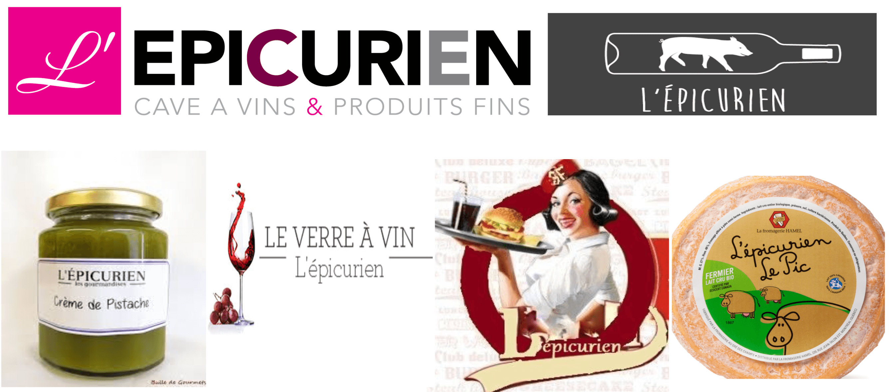

<!-- _class: titre -->

# Q2 –  Désirer, est-ce  souffrir ? <!-- fit -->
Cédric Eyssette (2021-2022)
https://eyssette.github.io/

---
<!-- _class: i1t1 vertical  pp -->

Steve Cutts, _Happiness_

<!-- 
Une norme sociale dominante : rats => effet de masse
Montage : toujours désirer autre chose
Présence massive de la publicité : (notamment référence au _Meilleur des mondes_ : “soma”)
Scène “Disney” : illusion, on retombe vite dans l'insatisfaction (chute)
piège à rat à la fin : coincés, prisonniers ?
 -->

---
<!-- _class: i1t1 horizontal fppp -->

1) De quoi ce court métrage est-il la critique ?
2) Cette critique vous semble-t-elle correcte ? Vivons-nous vraiment comme ces rats ?
3) De manière générale, pourquoi le désir peut-il nous faire souffrir ?

<!--
Ce court métrage est une critique de la société de consommation, qui constitue une norme sociale dominante, dont le fondement repose sur l'incitation à l'achat de toujours plus de biens matériels et de services, par le biais principalement de la publicité.
Plusieurs questions se posent : 
1. Le désir d'avoir toujours plus est-il source de bonheur ou de souffrance ?
2. La consommation nous conduit-elle à une satisfaction profonde ou bien superficielle ?
… durable ou éphémère ?
… réelle ou illusoire ?
3. Sommes-nous prisonniers de ce modèle social ? Sommes-nous esclaves de nos désirs ?
 -->

---
<!-- _class:  -->

:red_circle:

Schopenhauer

Épicure

vs.

---
<!-- _class:  -->
### Objectifs de ce cours

1) Comprendre différentes formes possibles de désir :large_blue_circle:
2) Comprendre l'opposition principale entre Schopenhauer et Épicure :red_circle:
3) Commencer à comprendre comment on problématise une question dans l'introduction de la dissertation  :red_circle:

---
<!-- _class:  -->

À première vue, le désir est …………………………………………………………………………………………………………………………………………………………………………<!-- un état psychique qui nous motive à agir, en vue de la satisfaction de nos besoins, de nos envies ou d'un objectif particulier. Nous ressentons comme agréable le fait de parvenir à réaliser nos désirs. Le désir semble par conséquent avoir pour finalité le plaisir plutôt que la souffrance. -->

Mais est-ce si simple ? En effet, …………………………………………………………………………………………………………………………………………………………………………

---
<!-- _class: partie -->
# I – Schopenhauer :  Le désir comme  souffrance <!-- fit -->
Première partie

---
<!-- _class: souspartie -->
## A. Première étape

---
<!-- _class: citationC -->

>« Tout vouloir naît du besoin, donc du manque, donc de la souffrance »
>>**Schopenhauer**, _Le Monde comme volonté et comme représentation_, Livre III, §38

---
<!-- _class: i1t1 vertical  -->

Le mythe d'Aristophane

 <!-- https://www.youtube.com/watch?v=fmDpwXCyFOI -->

<!-- L'amour : quête de plénitude, recherche d'une fusion avec autrui.
Le désir amoureux : l'expression d'un manque, d'un vide affectif en nous => une forme d'incomplétude.
Mais : 1/ On ne peut jamais avoir la certitude d'avoir trouvé notre “moitié”.
2/ La fusion est impossible : nous restons à jamais des individus séparés.
=> Le désir amoureux est une souffrance
 -->

---
<!-- _class: i1t0 pp -->

<!-- 
La publicité utilise plusieurs procédés pour donner aux individus l’envie d’acheter un produit ou un service.
Essayons d’analyser une publicité précise pour comprendre de manière plus concrète le mode de fonctionnement de la publicité.
Dans une publicité, tout est signifiant, tout a été conçu pour susciter en nous une envie d’acheter le produit ou le service proposé.
Il faut donc essayer de comprendre le sens de chaque élément et la manière dont ces éléments cherchent à créer en nous un désir.

- l'excitation des sens : la nudité, les cheveux, la bouteille effleurée devant la poitrine
=> envie “brute”
- perfection : signes du luxe et de la richesse (l'or : couleur, sonorités), de la distinction (Paris, absolu, la posture), de la beauté (retouches Photoshop pour correspondre à des "canons")
- mise en scène du désir pour l'objet : adore, l'objet touché
=> envie d'avoir (je n'ai pas ce qui est désirable, je n'ai pas ce que les autres désirent)
- transformation de l'individu grâce à l'objet : ambivalence du "Je" dans J'adore, Le féminin absolu, forme du parfum // femme (avoir le parfum : être comme cette femme) : mythe de Midas inversé (en touchant le parfum, je deviens quelqu'un d'autre : je me transforme)
=> envie d'être (je ne suis pas parfait·e)

Le faire sous forme de carte mentale :
La publicité Dior repose sur …
  - l'excitation des sens
    - la nudité, les cheveux, la bouteille effleurée devant la poitrine
  - la représentation d'un univers idéal :
    - signes du luxe et de la richesse (l'or : couleur, sonorités), de la distinction (Paris, absolu, la posture), de la beauté (retouches Photoshop pour correspondre à des "canons")
  - la mise en scène du désir pour l'objet :
    - j'adore, l'objet touché
  - la transformation de l'individu grâce à l'objet :
    - ambivalence du "Je" dans J'adore, Le féminin absolu, forme du parfum // femme (avoir le parfum : être comme cette femme) : mythe de Midas inversé (en touchant le parfum, je deviens quelqu'un d'autre : je me transforme)

Autres procédés possibles :
- valorisation du nouveau par rapport à l'ancien (désir d'avoir)
- affirmation d'une identité particulière ou identification à un groupe (désir d'être)

-->

---
<!-- _class: fmmm -->

Cette publicité repose sur … :

1) L'excitation des sens  &rarr; La nudité, les cheveux, le bain, le regard, la bouteille effleurée devant la poitrine
2) La représentation d'un univers idéal ou du moins supérieur  &rarr; L'or (signe de luxe, de richesse), une image retouchée sous Photoshop, le terme “_absolu_.”, les signes de distinction (“Paris”, “Dior”, la posture), la disposition dans l'espace : espace éthéré + verticalité + séparation marquée par le bras 
3) La mise en scène du désir pour l'objet (le désir mimétique)  &rarr; “J'adore”, l'objet touché par une mannequin
4) La prétendue transformation de l'individu grâce à l'objet  &rarr; L'ambivalence du “Je” dans “J'adore”, “_le féminin absolu_”, l'analogie entre la forme du parfum et le corps de la femme, la référence inversée au mythe de Midas

---
<!-- _class:  -->
### Exercice facultatif

1. Choisir dans un journal une image publicitaire, la découper et la coller sur une feuille
2. Faire l'analyse de cette image : comment cette image cherche-t-elle à susciter en nous le désir ?

---
<!-- _class: souspartie -->
## B. Deuxième étape

<!-- 
1ère étape : Le désir est frustration
2e étape : Cette frustration ne cesse pas, c'est un “supplice éternel”
Donc : le désir est une souffrance perpétuelle
 -->

---
<!-- _class: citationC fpppppp-->

>« [L]e sujet du vouloir […] remplit éternellement le tonneau des Danaïdes »
>>**Schopenhauer**, _Le Monde comme volonté et comme représentation_, Livre III, §38

---
<!-- _class: i1t0 pp -->

---
<!-- _class: fmm pp -->

|Image|Signification|
|:-:|:-:|
|Le tonneau plein|Le bonheur comme  état de plénitude|
|Le vide dans le tonneau|Un état de manque en nous,  un état d'insatisfaction|
|Remplir le tonneau|Chercher à combler ce manque  en satisfaisant nos désirs|
|Le tonneau est percé|Nous désirons toujours plus (= la pléonexie)|
|Le tonneau se  vide rapidement|La satisfaction est temporaire :  nous retombons vite dans l'insatisfaction|
|Le tonneau ne sera  jamais plein|Nous ne parviendrons pas au bonheur|

<!-- Trois exemples :
1. La société de consommation (court métrage Happiness)
2. Fortnite
3. Snapchat -->

---
<!-- _class: i1t1 pp fpppppp-->

[Extrait 1](https://ladigitale.dev/digiplay/#/v/6142dc67b285a) : les techniques de rétention dans Fortnite  <!-- https://youtu.be/uUlJarbHrMU?t=493 -->

[Extrait 2](https://ladigitale.dev/digiplay/#/v/6142dd12b6105) : les réseaux sociaux et l'économie de l'attention <!-- https://youtu.be/uUlJarbHrMU?t=2353 -->

<!--
Le succès du jeu Fortnite provient en partie de l'utilisation de techniques de rétention qui cherchent à retenir les personnes qui jouent dans le jeu, et à leur donner envie de jouer toujours plus. Exemples : systèmes de mission, d'objectifs, de customisation du jeu, de variantes (random, campagnes …)

Fortnite s'inscrit dans une économie de l'attention où l'enjeu économique est de capter l'attention des individus, par le biais de techniques fondées sur la connaisance de la psychologie humaine.
Exemples :
L'auto-play -> tendance à en rester à l'option par défaut (= le biais de statu quo)
Les likes -> Besoin de reconnaissance sociale
 -->

---
<!-- _class: i1t0 -->

<!-- 
Effet Ikea
Principe du don / contre-don
Désinhibition
Aversion à la perte
 -->

---
<!-- _class: partie -->
# II – Épicure :  Le simple plaisir  d'exister plutôt que  les désirs vains <!-- fit -->
Deuxième partie

---
<!-- _class: souspartie f -->
## A. Il faut réfléchir aux plaisirs que nous recherchons

---
<!-- _class: citationC -->

>« [L]e plaisir est le commencement et la fin de la vie heureuse »
>>**Épicure**, _Lettre à Ménécée_

<!-- Épicure défend une forme d'hédonisme -->

---
<!-- _class: definition -->
### Définition
L'**hédonisme** est une défense de la valeur du plaisir, c'est la thèse selon laquelle le plaisir est un bien qu'il faut rechercher

---
<!-- _class: i1t0 -->

---
<!-- _class:  -->
:warning:  “Être un épicurien” au sens commun désigne le fait d'être un bon vivant qui profite de tous les plaisirs.

Mais : c'est un contresens sur la philosophie d'Épicure.

---
<!-- _class: citationC fppppppp -->

>« Quand […] nous disons que le plaisir est le but de la vie, nous ne parlons pas des plaisirs voluptueux et inquiets […] Le plaisir dont nous parlons est celui qui consiste, pour le corps, à ne pas souffrir et, pour l’âme, à être sans trouble. »
>>**Épicure**, _Lettre à Ménécée_

---
<!-- _class: definition f-->

Épicure ne fait pas une critique moraliste des plaisirs, et il ne défend pas un ascétisme radical.

### Définitions
* **Une critique moraliste des plaisirs** consisterait à considérer les plaisirs comme des tentations mauvaises qui nous conduisent au vice.
* **L'ascétisme radical** désigne le fait de renoncer aux plaisirs, voire de s'imposer certaines souffrances en vue d'un idéal supérieur.

<!-- Exemples :  
ascétisme religieux : abstinence sexuelle, pratiques de mortification du corps, histoire d'Origène qui se serait lui-même castré / ascétisme sportif
Il ne s'agit pas de rendre la recherche du plaisir coupable, mais simplement de faire preuve de réflexion en vue de son propre bonheur
 -->

---
<!-- _class: definition -->

Pour Épicure, le plaisir qu'il faut rechercher c'est l'aponie et l'ataraxie.

### Définitions
* **L'aponie** désigne l'absence de souffrances dans le corps
* **L'ataraxie** désigne l'absence de troubles dans l'âme

---
<!-- _class: i2t1 contain  -->

Il faut distinguer deux formes d'hédonisme

---
<!-- _class: exercice tableau colonnes fmmmm-->
|L'hédonisme radical|L'hédonisme d'Épicure|
|:-:|:-:|
|?|?|
|?|?|
|?|?|

1. consiste à désirer toujours plus
2. démarche soustractive : il faut supprimer ce qui trouble notre corps et notre âme
3. un hédonisme de l'excès, qui recherche les plaisirs dans la démesure
4. consiste à retrouver le plaisir simple d'exister
5. démarche additive, voire multiplicative : on veut ajouter sans cesse de nouvelles expériences de plaisir
6. un hédonisme mesuré, qui préfère les plaisirs stables

---
<!-- _class: exercice tableau-r fmm-->
|L'hédonisme radical|L'hédonisme d'Épicure|
|:-:|:-:|
|_1_ consiste à désirer  toujours plus|_4_ consiste à retrouver le plaisir simple d'exister|
|_3_ un hédonisme de l'excès,  qui recherche les plaisirs  dans la démesure|_6_ un hédonisme mesuré, qui préfère les plaisirs stables|
|_5_ démarche additive, voire multiplicative : on veut ajouter sans cesse de nouvelles expériences de plaisir|_2_ démarche soustractive : il faut supprimer ce qui trouble notre corps et notre âme|

- Qu'est-ce qui peut troubler notre corps et notre âme ?

---
<!-- _class: entete approfondissement -->
### Approfondissement

Parmi ce qui peut troubler notre corps et notre âme, il y a, pour Épicure, plusieurs croyances fausses, sur les Dieux et sur la mort, qui peuvent nous empêcher de retrouver le simple plaisir d'exister.

Vous pouvez consulter ce [schéma pour comprendre ce que dit l'épicurisme à propos des dieux et de la mort](https://raw.githubusercontent.com/eyssette/graphviz-examples/master/diagram/epicurisme-supprimer-croyances-fausses.svg).

---
<!-- _class: souspartie f-->
## B. Il faut savoir identifier les désirs qui nous troublent et nous  éloignent du bonheur

---
<!-- _class: citationC -->

>« Il faut se rendre compte que parmi nos désirs les uns sont naturels les autres vains »
>>**Épicure**, _Lettre à Ménécée_

---
<!-- _class: cinema -->

> « Antonio “Tony” Montana (Al Pacino) […] est un petit malfrat cubain qui migre vers Miami dans l'espoir de faire fortune. Il trouve au départ un petit boulot dans une baraque à frites de Miami. Mais travailler pour quelques dollars ne correspond pas à l'idée qu'il se fait du « rêve américain ». Il se fait alors embaucher par un malfrat local puis par Frank Lopez, son patron]. […] Tony apprend vite le métier de mafioso de la drogue : il monte en grade […] Il a les dents beaucoup plus longues que ses collègues, il est mégalomane, ambitieux et d'une intelligence plus perverse. Il prend pour adage : _The World is Yours_ (Le monde est à toi) [...] Mais il commence à faire des erreurs dans ce monde qui ne pardonne pas, où l'on est vite remplacé. Il prend conscience que d'être arrivé au sommet de la mafia ne le rend pas aussi heureux qu'il l'avait espéré, qu'il n'est pas capable de rendre heureuses les personnes qu'il aime&nbsp;» (source : [wikipedia](https://fr.wikipedia.org/wiki/American_History_X))

---
<!-- _class: -->

1) 
1) 
1) 
1) 
1) 
1) 

---
<!-- _class:  -->

1. Les désirs vains  &rarr; Il faut y renoncer, il faut s'en libérer
2. Les désirs naturels  &rarr; Ils correspondent à des besoins fondamentaux qu'il faut satisfaire, mais il faut rester prudent

---
<!-- _class: cinema fmmm -->

>« Michael Fassbender se mue ici en cadre supérieur new yorkais à la vie très cloisonnée, incapable de vivre sa sexualité autrement que par le recours à la pornographie, à la prostitution, aux rencontres sans lendemain. [...] Steve McQueen dessine le portrait d’un homme perdu, esclave de ses démons. Captant un monde quadrillé à l’extrême (rues, façades de verre, bureaux, écrans…), jouant sur le paradoxe d’une infranchissable transparence, le réalisateur explore les méandres d’une solitude très contemporaine. » ([source](http://www.la-croix.com/Culture-Loisirs/Culture/Cinema/Shame-l-infranchissable-mur-de-la-vraie-rencontre-_EG_-2011-12-06-744235))

---
<!-- _class: citationC fpppp -->

>« Tout plaisir, pris en lui-même et dans sa nature propre est […] un bien, et cependant tout plaisir n’est pas à rechercher pareillement […] En tout cas, chaque plaisir et chaque douleur doivent être appréciés par une comparaison des avantages et des inconvénients à attendre. »
>>**Épicure**, _Lettre à Ménécée_

---
<!-- _class:  -->

1) Il ne s'agit pas de se priver de plaisirs, mais simplement de calculer les conséquences (= la métriopathie).

2) Il ne s'agit pas d'atteindre un maximum de plaisirs, mais simplement de pouvoir toujours savourer le simple plaisir d'exister.

---
<!-- _class:  -->
Le bonheur est défini ici comme un retour à notre nature.

Il faut savoir revenir à ce qu'il y a d'essentiel pour nous, en tant qu'êtres vivants et en tant qu'êtres humains.

<!-- Mais : y a-t-il une nature humaine universelle ? La nature peut-elle être un modèle qui fixe des normes à notre existence ? -->

---
<!-- _class: entete approfondissement -->
### Approfondissement

On retrouve parfois une référence à Épicure dans certains mouvements contemporains autour des thèmes de la simplicité volontaire, de la décroissance ou de la sobriété heureuse.

Vous pouvez lire un [document à propos de la simplicité volontaire](https://docs.google.com/document/d/1bj-Z10wRiGp6H8erRwLmp8BmHtYTJgWaLBc3HalJT_A/edit?usp=sharing) afin de voir quelle comparaison on peut faire entre l'épicurisme et ce mouvement

---
<!-- _class: partie -->
# Mise en pratique

---
<!-- _class: exercice application fmmmm -->

### Exercice d'application

- Choisir un sujet ci-dessous :
  - Le progrès technique rend-il heureux ?
  - Le bonheur n'est-il qu'une illusion ?
  - Le désir est-il la marque de notre imperfection ?
  - Le désir peut-il se satisfaire de la réalité ?
  - Satisfaire tous ses désirs, est-ce une bonne règle de vie ?
  - La réflexion est-elle un obstacle au bonheur ?
  - Le bonheur peut-il s’apprendre ?
  - Y a-t-il des désirs naturels ?
- Rédiger une sous-partie de dissertation (200 mots minimum) : :warning: il faut défendre une seule réponse, mobiliser le cours (Schopenhauer ou Épicure), et utiliser le modèle ARES