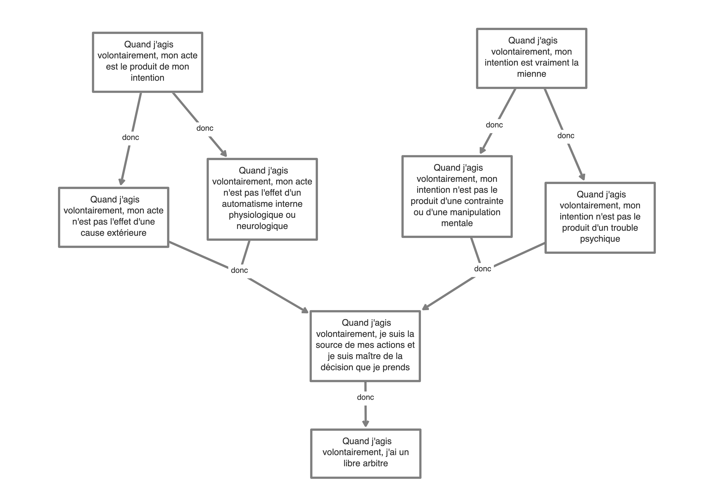

<!-- _class: titre -->

# Q1 – L'expérience de l'action volontaire est-elle une preuve du libre arbitre ? 
Cédric Eyssette (2021-2022)
https://eyssette.github.io/

---
<!-- _class:  -->
### Expérience

1) Poser le bras sur la table et lever votre bras par vous-même.
2) Poser le bras sur la table et demander à quelqu'un de vous lever le bras.

---
<!-- _class: sanspuces -->

Il y a une différence, que nous **ressentons** intérieurement, entre les actes causés par un élément **extérieur** (“avoir le bras levé par quelqu'un”) et les actes initiés par nous, qui proviennent de notre **volonté** (“lever son bras”).

1) L'expérience ordinaire semble ainsi nous indiquer que nous sommes la **source** de nos actes et **maîtres** de nos décisions.

---
<!-- _class: fpppppp -->

### Les troubles du sentiment de l'agentivité <!-- fit -->

1) La schizophrénie
	* « [C]’est une autre personne qui agit et qui parle à ma place, je ne suis qu’un pauvre mannequin tiré par des ficelles de tous les côtés » ; « Je ne suis qu'un pantin qui est manipulé par des ficelles cosmiques » (Marc Jeannerod, _Le cerveau volontaire_, p.231)
2) Le syndrome de la main étrangère :
	* Le cas de [Karen Byrne](https://ladigitale.dev/digiplay/#/v/61a5e1f52e0c4)

---
<!-- _class: i1t1 vertical -->

### L'expérience de Libet

<!-- Analyse critique de cette expérience : voir la thèse de Jean-Baptiste Guillon, p.403-411 -->

---
<!-- _class:  -->

:red_circle:

L'argument de  l'action volontaire

Les limites de cet argument

vs.

<!--
Textes : 
 -->

---
<!-- _class: partie -->
# I - L'argument de l'action volontaire
Première partie

---
<!-- _class: i1t0 -->

---
<!-- _class: i1t0 -->

---
<!-- _class: citationC fmm-->

>« Le cœur d’un homme bât, le sang circule, et il n’a pas le pouvoir de l’arrêter par une pensée ou une volition. Et donc, en ce qui concerne ces mouvements dont l’arrêt ne dépend pas de son choix et ne pourrait procéder d’une directive de son esprit qui le préfèrerait, il n’est pas un agent libre. Des mouvements convulsifs agitent ses jambes ; il voudrait désespérément en arrêter le mouvement et pourtant, par aucun pouvoir de l’esprit, il ne le peut (comme dans cette vieille maladie étrange nommée *Chorea scanti Viti*), et il danse indéfiniment : dans cette action, il n’est pas libre mais il est soumis à la nécessité de bouger, comme une pierre qui tombe ou une balle de tennis lancée par une raquette. »
>>John **Locke**, *Essai sur l'entendement*, livre II, chap. XXI, §11

---
<!-- _class: sanspuces fpp -->

### Argument
1) Quand j'agis volontairement, mon acte est le produit de mon intention.
2) Donc mon acte n'est … :
	* … ni l'effet d'une cause extérieure (“tomber à cause d'une peau de banane”),
	* … ni l'effet d'un automatisme interne physiologique ou neurologique (battements de cœur, maladie de Huntington).
3) Donc : Quand j'agis volontairement, je suis la source de mon acte et je suis maître de la décision que je prends.

---
<!-- _class: i1t1 vertical -->

Radio Alfa - https://www.flickr.com/photos/radioalfa/32229172326

---
<!-- _class: i1t0 -->

---
<!-- _class: i1t1 vertical -->

Un film de Xavier Dolan : _Mommy_ (2014)

---
<!-- _class: sanspuces fppp -->

### Argument
1) Quand j'agis volontairement, mon intention est vraiment la mienne.
2) Donc mon intention n'est … :
	* … ni le produit d'une contrainte (menace, intimidation, chantage…) ou d'une manipulation mentale (endoctrinement),
	* … ni le produit d'un trouble psychique (l'agressivité de Steve dans le film _Mommy_).
3) Donc : quand j'agis volontairement, je suis la source de mon acte et je suis maître de la décision que je prends.

---
<!-- _class: i1t0 pp -->
[](https://eyssette.github.io/argument-map/#[{%22id%22:%22hf4bp%22,%22text%22:%22Quand%20j'agis%20volontairement,%20mon%20acte%20est%20le%20produit%20de%20mon%20intention%22,%22x%22:265,%22y%22:109,%22lineType%22:%22solid%22},{%22id%22:%22j6ikl%22,%22text%22:%22Quand%20j'agis%20volontairement,%20mon%20intention%20est%20vraiment%20la%20mienne%22,%22x%22:955,%22y%22:102,%22lineType%22:%22solid%22},{%22id%22:%22lbjtp%22,%22text%22:%22Quand%20j'agis%20volontairement,%20mon%20acte%20n'est%20pas%20l'effet%20d'une%20cause%20ext%C3%A9rieure%22,%22x%22:204,%22y%22:388,%22lineType%22:%22solid%22},{%22id%22:%229y51w%22,%22text%22:%22Quand%20j'agis%20volontairement,%20mon%20acte%20n'est%20pas%20l'effet%20d'un%20automatisme%20interne%20physiologique%20ou%20neurologique%22,%22x%22:471,%22y%22:356,%22lineType%22:%22solid%22},{%22id%22:%22zpt26%22,%22text%22:%22Quand%20j'agis%20volontairement,%20mon%20intention%20n'est%20pas%20le%20produit%20d'une%20contrainte%20ou%20d'une%20manipulation%20mentale%22,%22x%22:821,%22y%22:351,%22lineType%22:%22solid%22},{%22id%22:%22z7k97%22,%22text%22:%22Quand%20j'agis%20volontairement,%20mon%20intention%20n'est%20pas%20le%20produit%20d'un%20trouble%20psychique%22,%22x%22:1078,%22y%22:389,%22lineType%22:%22solid%22},{%22id%22:%2209z96%22,%22text%22:%22Quand%20j'agis%20volontairement,%20je%20suis%20la%20source%20de%20mes%20actions%20et%20je%20suis%20ma%C3%AEtre%20de%20la%20d%C3%A9cision%20que%20je%20prends%22,%22x%22:656,%22y%22:620,%22lineType%22:%22solid%22},{%22id%22:%22wu9in%22,%22text%22:%22Quand%20j'agis%20volontairement,%20j'ai%20un%20libre%20arbitre%22,%22x%22:657,%22y%22:813,%22lineType%22:%22solid%22},{%22id%22:%22d1ohi%22,%22type%22:%22donc%22,%22from%22:[%22hf4bp%22],%22to%22:%22lbjtp%22},{%22id%22:%22faqhf%22,%22type%22:%22donc%22,%22from%22:[%22hf4bp%22],%22to%22:%229y51w%22},{%22id%22:%22ce7ts%22,%22type%22:%22donc%22,%22from%22:[%22j6ikl%22],%22to%22:%22zpt26%22},{%22id%22:%22839fg%22,%22type%22:%22donc%22,%22from%22:[%22j6ikl%22],%22to%22:%22z7k97%22},{%22id%22:%22jp6md%22,%22type%22:%22donc%22,%22from%22:[%2209z96%22],%22to%22:%22wu9in%22},{%22id%22:%22pqti6%22,%22type%22:%22donc%22,%22from%22:[%229y51w%22,%22lbjtp%22],%22to%22:%2209z96%22},{%22id%22:%22705gb%22,%22type%22:%22donc%22,%22from%22:[%22zpt26%22,%22z7k97%22],%22to%22:%2209z96%22}])

<!-- 
≠ Argument des possibilités alternatives
https://eyssette.github.io/argument-map/#[{"id":"gneop","type":"donc","from":["zpt26"],"to":"jozk6"},{"id":"be0s9","type":"donc","from":["jozk6"],"to":"levpg"},{"id":"levpg","text":"Quand je prends une décision après réflexion, j'ai un libre arbitre","x":460,"y":721,"lineType":"solid"},{"id":"jozk6","text":"Quand je prends une décision après réflexion, je suis maître de la décision que je prends","x":455,"y":541,"lineType":"solid"},{"id":"znd79","type":"donc","from":["a6ryk"],"to":"zpt26"},{"id":"a6ryk","text":"Quand je réfléchis avant de prendre une décision, je peux envisager plusieurs possibilités","x":459,"y":160,"lineType":"solid"},{"id":"zpt26","text":"Quand je prends une décision après réflexion, j'aurais pu faire un autre choix","x":458,"y":353,"lineType":"solid"}]
 -->

---
<!-- _class: partie -->
# II – Les limites de cet argument
Deuxième partie

---
<!-- _class: i1t0  -->

<!-- 
Ces androïdes ont-ils un libre arbitre ?
Y a-t-il une différence fondamentale entre ces androïdes et nous-mêmes ?
 -->

---
<!-- _class: citationC -->

>« Telle est cette liberté humaine que tous les hommes se vantent d'avoir et qui consiste en cela seul que les hommes sont conscients de leurs désirs et ignorants des causes qui les déterminent ! »
>>**Spinoza**, _Lettre 58_ à Schuller

<!-- 
Schéma des deux objections : 
https://eyssette.github.io/argument-map/#[{%22id%22:%22c1%22,%22text%22:%22Le%20sentiment%20d'%C3%AAtre%20libre%20n'est%20pas%20une%20preuve%20du%20libre%20arbitre%22,%22x%22:296,%22y%22:407,%22lineType%22:%22solid%22},{%22id%22:%22p1%22,%22text%22:%22Cette%20croyance%20est%20motiv%C3%A9e%20par%20le%20d%C3%A9sir%20de%20nous%20croire%20sup%C3%A9rieurs%22,%22x%22:297,%22y%22:178,%22lineType%22:%22solid%22},{%22id%22:%22cfkpx%22,%22text%22:%22Nous%20avons%20le%20sentiment%20d'%C3%AAtre%20libre%20parce%20que%20nous%20croyons%20%C3%AAtre%20ma%C3%AEtres%20de%20nos%20actes%22,%22x%22:66,%22y%22:195,%22lineType%22:%22solid%22},{%22id%22:%22sx5ek%22,%22text%22:%22Si%20une%20croyance%20est%20motiv%C3%A9e%20par%20un%20d%C3%A9sir%20de%20croire,%20ce%20n'est%20pas%20une%20croyance%20fiable%22,%22x%22:529,%22y%22:196,%22lineType%22:%22solid%22},{%22id%22:%22jkb1f%22,%22type%22:%22donc%22,%22from%22:[%22panis%22,%22p2%22,%229eo2c%22],%22to%22:%22mgr1a%22},{%22id%22:%22pc12j%22,%22type%22:%22donc%22,%22from%22:[%22cfkpx%22,%22p1%22,%22sx5ek%22,%22sx5ek%22],%22to%22:%22c1%22},{%22id%22:%22mgr1a%22,%22text%22:%22Le%20sentiment%20d'%C3%AAtre%20libre%20n'est%20pas%20une%20preuve%20du%20libre%20arbitre%22,%22x%22:1021,%22y%22:458,%22lineType%22:%22solid%22},{%22id%22:%22panis%22,%22text%22:%22S'il%20existe%20des%20facteurs%20inconscients%20qui%20d%C3%A9terminent%20nos%20actes,%20alors%20cette%20croyance%20est%20fausse%22,%22x%22:1025,%22y%22:202,%22lineType%22:%22solid%22},{%22id%22:%22p2%22,%22text%22:%22Nous%20avons%20le%20sentiment%20d'%C3%AAtre%20libre%20parce%20que%20nous%20croyons%20%C3%AAtre%20la%20source%20de%20nos%20actes%22,%22x%22:808,%22y%22:226,%22lineType%22:%22solid%22},{%22id%22:%229eo2c%22,%22text%22:%22Il%20est%20possible%20d'avoir%20le%20sentiment%20d'%C3%AAtre%20libre%20alors%20qu'il%20existe%20en%20fait%20des%20facteurs%20inconscients%20qui%20d%C3%A9terminent%20nos%20actes%22,%22x%22:1241,%22y%22:228,%22lineType%22:%22solid%22}]
 -->

---
<!-- _class: fppppp sanspuces -->

### Argument 1 [:link:](https://eyssette.github.io/argument-map/#[{%22id%22:%22c1%22,%22text%22:%22Le%20sentiment%20d'%C3%AAtre%20libre%20n'est%20pas%20une%20preuve%20du%20libre%20arbitre%22,%22x%22:433,%22y%22:326,%22lineType%22:%22solid%22},{%22id%22:%22p1%22,%22text%22:%22Cette%20croyance%20est%20motiv%C3%A9e%20par%20le%20d%C3%A9sir%20de%20nous%20croire%20sup%C3%A9rieurs%22,%22x%22:434,%22y%22:97,%22lineType%22:%22solid%22},{%22id%22:%22cfkpx%22,%22text%22:%22Nous%20avons%20le%20sentiment%20d'%C3%AAtre%20libre%20parce%20que%20nous%20croyons%20%C3%AAtre%20ma%C3%AEtres%20de%20nos%20actes%22,%22x%22:203,%22y%22:113,%22lineType%22:%22solid%22},{%22id%22:%22sx5ek%22,%22text%22:%22Si%20une%20croyance%20est%20motiv%C3%A9e%20par%20un%20d%C3%A9sir%20de%20croire,%20ce%20n'est%20pas%20une%20croyance%20fiable%22,%22x%22:666,%22y%22:114,%22lineType%22:%22solid%22},{%22id%22:%22pc12j%22,%22type%22:%22donc%22,%22from%22:[%22cfkpx%22,%22p1%22,%22sx5ek%22,%22sx5ek%22],%22to%22:%22c1%22}])

1) (1) Nous avons le sentiment d'être libre parce que nous croyons être maîtres de nos actes.
2) (2) Cette croyance est motivée par le désir de nous croire supérieurs.
3) (3) Si une croyance est motivée par un désir de croire, ce n'est pas une croyance fiable.

4) _Donc :_ Le sentiment d'être libre n'est pas une preuve du libre arbitre.

---
<!-- _class: fpp sanspuces -->

### Argument 2 [:link:](https://eyssette.github.io/argument-map/#[{%22id%22:%22panis%22,%22text%22:%22S'il%20existe%20des%20facteurs%20inconscients%20qui%20d%C3%A9terminent%20nos%20actes,%20alors%20cette%20croyance%20est%20fausse%22,%22x%22:601,%22y%22:161,%22lineType%22:%22solid%22},{%22id%22:%22jkb1f%22,%22type%22:%22donc%22,%22from%22:[%22panis%22,%22p2%22,%229eo2c%22],%22to%22:%22mgr1a%22},{%22id%22:%22mgr1a%22,%22text%22:%22Le%20sentiment%20d'%C3%AAtre%20libre%20n'est%20pas%20une%20preuve%20du%20libre%20arbitre%22,%22x%22:596,%22y%22:444,%22lineType%22:%22solid%22},{%22id%22:%22p2%22,%22text%22:%22Nous%20avons%20le%20sentiment%20d'%C3%AAtre%20libre%20parce%20que%20nous%20croyons%20%C3%AAtre%20la%20source%20de%20nos%20actes%22,%22x%22:351,%22y%22:216,%22lineType%22:%22solid%22},{%22id%22:%229eo2c%22,%22text%22:%22Il%20est%20possible%20d'avoir%20le%20sentiment%20d'%C3%AAtre%20libre%20alors%20qu'il%20existe%20en%20fait%20des%20facteurs%20inconscients%20qui%20d%C3%A9terminent%20nos%20actes%22,%22x%22:852,%22y%22:222,%22lineType%22:%22solid%22}])

1) (1) Nous avons le sentiment d'être libre parce que nous croyons être la source de nos actes.
2) (2) S'il existe des facteurs inconscients qui déterminent nos actes, alors cette croyance est fausse.
3) (3) Il est possible d'avoir le sentiment d'être libre alors qu'il existe en fait des facteurs inconscients qui déterminent nos actes.

4) _Donc :_ Le sentiment d'être libre n'est pas une preuve du libre arbitre.

---
<!-- _class: exercice application fmmmmm -->

### Exercice d'application

- Choisir un sujet ci-dessous :
	- Le libre arbitre est-il une illusion ?
	- Être libre, est-ce pouvoir choisir ?
	- Pouvons-nous faire l'expérience de la liberté ?
	- La spontanéité est-elle une marque de liberté ?
	- Un être humain est-il responsable de tout ce qu'il fait ?
	- L’idée d’une liberté totale a-t-elle un sens ?
	- Une contrainte est-elle un obstacle à la liberté ?
	- Choisir, est-ce renoncer à sa liberté ?
- Rédiger une sous-partie de dissertation (autour de 300 mots)  :warning:  il faut défendre une seule réponse, mobiliser le cours, et utiliser le modèle _ARES_