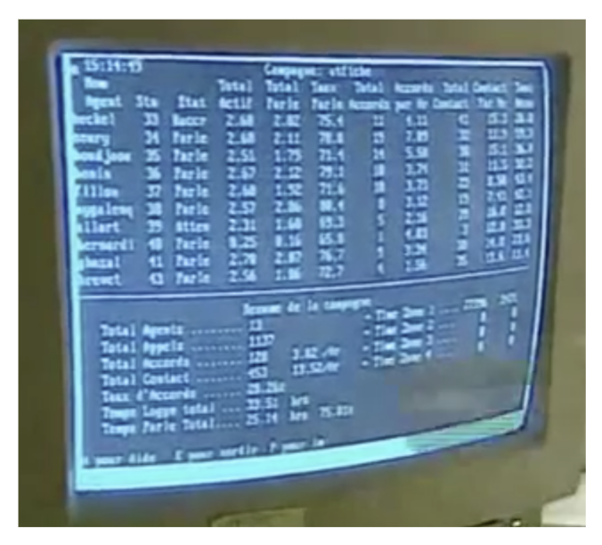

<!-- _class: titre -->

# Q2 – Le développement  technique transforme-t-il  les êtres humains ? <!-- fit -->
Cédric Eyssette (2022-2023)
https://eyssette.github.io/

---
<!-- _class: i1t1 vertical -->

Le transhumanisme

<!-- https://www.youtube.com/watch?v=bTMS9y8OVuY -->

<!-- Trois super
1. Super longévité
2. Super intelligence
3. Super

 -->

---
<!-- _class:  -->
### Trois objectifs du transhumanisme <!-- fit -->

**1/ Super longévité**

Refus de tout prétendu destin naturel : on pourrait supprimer la vieillesse et la mort.

Max More : _Lettre à Mère Nature_

---
<!-- _class:  -->
**2/ Super intelligence**

Objectif fondé sur :

– les progrès dans l'I.A. (intelligence artificielle)

– la possibilité d'une symbiose avec la technique (= intégration de la technique dans notre corps, dans notre cerveau ≠ simples outils externes).

---
<!-- _class:  -->
**3/ Super bien-être**

Objectif fondé sur la possibilité de transformer les émotions humaines par des interventions biotechnologiques : des pilules ou même des modifications génétiques.

---
<!-- _class:  -->
### Deux questions
1) L'idéal transhumaniste est-il un objectif à poursuivre ?
2) Le transhumanisme est-il vraiment une rupture radicale ? L'être humain n'est-il pas de toute façon déjà façonné par la technique ?

---
<!-- _class: partie -->
# I –  La technique  comme essence  de l'être humain <!-- fit -->
Première partie

---
<!-- _class:  -->
**Rappel :** le mythe de Prométhée souligne le statut essentiel de la technique pour l'être humain

---
<!-- _class: fppp -->
**En effet :**
1) Par comparaison avec les animaux, la technique semble jouer un rôle fondamental pour l'être humain
2) L'histoire de l'humanité montre que la technique a toujours joué un rôle essentiel :
    1) dès la Préhistoire, les êtres humains ont façonné des outils
    2) la technique est un facteur important de changements historiques

---
<!-- _class: citationC fppp-->

>« En ce qui concerne l’intelligence humaine, on n’a pas assez remarqué que l’invention mécanique a d’abord été sa démarche essentielle […] Si nous pouvions nous dépouiller de tout orgueil, si, pour définir notre espèce, nous nous en tenions strictement à ce que l’histoire et la préhistoire nous présentent comme la caractéristique constante de l’homme et de l’intelligence, nous ne dirions peut-être pas _Homo sapiens_, mais _Homo faber_ »
>> **Bergson**, _L'évolution créatrice_, chapitre II 

<!-- 

Faire noter : 
En ce sens, Bergson affirme que l'être humain ne devrait pas être nommé _homo sapiens_ (capable de penser), mais _homo faber_ (capable de fabriquer).

---
On caractérise souvent la spécificité de l'être humain par son intelligence, raison pour laquelle notre espèce est nommée _homo sapiens_. Mais l'intelligence des êtres humains ne se manifeste-t-elle pas avant tout dans la capacité à inventer des techniques, des moyens efficaces pour parvenir à ses fins, des outils et des objets qui sont les produits de cette intelligence pratique ?

Bergson suggère en ce sens qu'on devrait nommer notre espèce _homo faber_ plutôt qu'_homo sapiens_ afin de mettre en évidence le caractère central de la technique dans l'évolution humaine.
-->

---
<!-- _class:  -->
**Mais :**

- La technique est-elle vraiment le propre des êtres humains ?
- N'y a-t-il pas de la technique chez les animaux ?

---
<!-- _class: i1t1 vertical f pp -->

[:link:](https://ladigitale.dev/digiview/#/v/645ca37a761b2) [:link:](https://ladigitale.dev/digiview/#/v/645ca396a8789) [:link:](https://ladigitale.dev/digiview/#/v/645ca3aac83b6)

<!--
Loutres de mer : https://ladigitale.dev/digiview/#/v/645ca37a761b2

Poulpe : https://ladigitale.dev/digiview/#/v/645ca396a8789

Corbeaux : https://ladigitale.dev/digiview/#/v/645ca3aac83b6

https://www.youtube.com/watch?v=_pFzgHTjuGQ&list=PLyNuTVPEjAXLqqBHSoHa_KtT1VNpXio9e&index=13&t=80s
-->

---
<!-- _class: fmm -->

Les techniques humaines sont l'expression de l'inventivité spécifique des êtres humains :
1) Transformation et invention de matériaux ≠ usage simplement d'éléments naturels
2) Invention de procédés complexes qui supposent un contrôle conscient de son activité et une transmission culturelle riche ≠ simple comportement instinctif ou rares inventions et transmissions
3) Invention de gestes précis, d'outils, de machines ≠ faible capacité manipulatoire et simples prolongements du corps
4) Invention d'objets pour des finalités très variées ≠ finalités simplement biologiques

---
<!-- _class: partie -->
# II – Des transformations  inquiétantes ? <!-- fit -->
Deuxième partie

---
<!-- _class: definition fp -->

Nous allons discuter ici la thèse du **déterminisme technique**.

### Définition

Le **déterminisme technique** est l'idée que l'introduction de certains dispositifs techniques détermine, ou du moins participe, à produire des transformations importantes dans l'économie, la société, les individus eux-mêmes, ou encore l'environnement

---
<!-- _class: definition fpppp -->

Cette thèse s'oppose à la thèse de la **neutralité de la technique**

### Définition

C'est l'idée que la technique ne fait rien, elle est **neutre** : c'est l'être humain qui fait quelque chose avec la technique.
La technique n'est qu'un **moyen** à notre service, dont nous **maîtrisons** l'usage

---
<!-- _class: souspartie -->

## A. Une transformation de l'économie et  de la société ? 

<!-- On ne peut pas parler abstraitement des effets possibles de la technique sur l'économie et la société. Sur cette question, il y a plus précisément, quatre débats intéressants. -->

---
<!-- _class: etape -->
### 1) La mécanisation (XIXe siècle)

- Dans quelle mesure l'introduction de machines dans le travail à partir du XIXe siècle change-t-elle les conditions de travail ?

---
<!-- _class: i1t0 pp-->

---
<!-- _class: pp -->

<iframe height="90%" width="90%" scrolling="no" src="https://mymarkmap.vercel.app/##%20Double%20%5C%5C%20division%20%5C%5C%20du%20travail%0A%0A##%20Division%20%5C%5C%20++verticale++%20%5C%5C%20du%20travail%20%3C!--fold--%3E%0A%0A-%20=%20Les%20**ing%C3%A9nieurs**%20con%C3%A7oivent%0Ale%20produit%20et%20la%20mani%C3%A8re%20la%0Aplus%20efficace%20de%20le%20produire%0A%0A-%20&rArr;%20Les%20**ouvriers**%20%7B%7B%20doivent%C2%A0%5C%5C%20simplement%20ex%C3%A9cuter%20%5C%5C%20les%20t%C3%A2ches%20qu'on%20leur%20%5C%5C%20indique%20de%20faire%20%7D%7D%0A%0A##%20Division%20%5C%5C%20++horizontale++%20%5C%5C%20du%20travail%20%3C!--fold--%3E%0A%0A-%20=%20une%20**parcellisation**%20%5C%5Cmaximale%20du%20travail%0A%0A-%20&rArr;%20Les%20ouvriers%20%7B%7B%20doivent%20%5C%5C%20accomplir%20%20des%20**t%C3%A2ches%20%5C%5C%20%C3%A9l%C3%A9mentaires,%20%C2%A0r%C3%A9p%C3%A9titives%20%5C%5Cet%20cadenc%C3%A9es**%20%7D%7D"></iframe>

---
<!-- _class: fppppppp -->
**Objectif visé :** la productivité (production rapide en masse, avec un coût le plus faible possible)

**Mais conséquence sur le travail :** le travail lui-même devient mécanique ; l'ouvrier devient une sorte de machine.

<!-- L'ouvrier sera d'ailleurs remplacé par des machines dès que ce sera possible
-->

Pour approfondir l'analyse critique de ce type de travail, on peut mobiliser la notion d'**aliénation** que propose Marx (avant la mise en place du taylorisme)

---
<!-- _class:  -->

De manière générale, l'aliénation désigne le fait de ne plus avoir quelque chose. C'est une perte, une privation, une dépossession.

<!-- alius : autre / -nus : appartenance, provenance -->

“aliénation mentale” : ne plus avoir la raison
“aliénation juridique” : transmission d'un bien (on ne l'a plus)
“droits inaliénables” : on ne peut pas nous les enlever (on les a toujours)

---
<!-- _class: citationC fp -->

> « Dans la manufacture et le métier, l’ouvrier se sert de son outil ; dans la fabrique il sert la machine […] [L]e travail mécanique […] empêche le jeu varié des muscles et comprime toute activité libre du corps et de l’esprit. […] [L]a machine ne délivre pas l’ouvrier du travail mais dépouille le travail de son intérêt. […] L'habileté de l'ouvrier apparaît chétive devant la science prodigieuse, les énormes forces natu­relles, […] incorporées au système mécanique […]. La subordination technique de l'ouvrier […] [crée] une discipline de caserne »
>> Karl **Marx**, _Le Capital_, I, XV, IV

---
<!-- _class: fpppp -->
Marx distingue deux formes possibles d'aliénation dans le travail.

### a) L'aliénation par rapport au produit du travail <!-- fit --> 
“L'objet produit n'est pas de moi”
= je ne me reconnais pas dans l'objet car il n'exprime rien de moi (aucune capacité physique ou intellectuelle)
&rarr;  je ne m'affirme pas dans mon travail, je suis nié en tant qu'être humain et en tant qu'individu
&rArr; sentiment d'insignifiance : perte de sens

---
<!-- _class:  -->
### b) L'aliénation par rapport à l'acte de travail
“La manière de travailler n'est pas de moi”
= je ne décide pas de ma manière de travailler, je ne contrôle pas ce que je fais
&rarr; c'est un travail contraint, soumis
&rArr; sentiment d'impuissance : perte de contrôle

---
<!-- _class:  -->
Le taylorisme semble produire de l'aliénation :

La division horizontale du travail produit de l'insignifiance = 1 aliénation par rapport au produit du travail

La division verticale du travail produit de l'impuissance = 1 aliénation par rapport à l'acte de travail

<!-- 

L'aliénation désigne le fait de ne plus avoir quelque chose
alius : autre
-nus : indique la provenance, l'origine, l'appartenance

=> Aliénation : dépossession, perte, privation

- L'aliénation mentale désigne la folie, la perte de la raison (ne plus avoir la raison)
- L'aliénation juridique désigne la transmission d'un bien (on ne le possède plus)  (ne plus avoir un bien)
- Un droit inaliénable est un droit qu'on ne peut pas perdre, qu'on ne peut pas nous enlever (on ne peut pas faire en sorte que je ne l'ai plus)

Perte de sens, insignifiance :
un travail dans lequel l'individu se nie ≠ s'affirme
(≠ activité libre du corps et de l'esprit)
pas de réalisation, de reconnaissance de soi dans l'objet produit (qui devient étranger)
= aliénation par rapport au produit de son travail
perte de son humanité et de son individualité
pas d'affirmation de soi en tant qu'être humain / en tant qu'individu

(// division horizontale du travail)

L'objet produit n'est plus à moi / n'est plus de moi / n'est plus la réalisation de moi

Perte de puissance, impuissance :
= aliénation par rapport au processus de production
= aliénation par rapport à l'acte de travailler lui-même
"dans l'acte de la production, à l'intérieur de l'activité productive elle-même"
pas contrôlé par l'individu, pas choisi, soumis aux autres / soumis à la machine (“discipline de caserne”, “sert la machine”)
Pas de reconnaissance de soi dans sa propre activité productive

La manière de travailler n'est plus de moi

(// division verticale du travail)

= aliénation subjective

+ aliénation objective ("habileté… apparaît chétive devant la science prodigieuse, les énormes forces naturelles,… incorporées au système mécanique")
aliénation du monde même dans lequel je vis

les forces productives s'autonomisent et deviennent étrangères aux hommes : plus de maîtrise
-->

---

<!-- Exemples et références pas contemporaines => actualité du taylorisme ?
Taylorisme au départ lié au secteur secondaire
Avec la tertiarisation des activités : ?
Mais en fait : extension du taylorisme à d'autres domaines, notamment dans les services
-->

Usage de la commande vocale pour les préparateurs de commande : extrait du documentaire _Travail, ton univers impitoyable_ [+](https://ladigitale.dev/digiview/#/v/645cb56d1efff)

<!-- https://www.youtube.com/watch?v=s5uHC6TN2wo&t=1100s -->

---
<!-- _class: etape -->
### 2) Le numérique au XXe siècle

<!-- L'ordinateur et le numérique -->

---
<!-- _class: fpppp -->

Au XXe siècle, l'organisation du travail se modifie, à partir des années 60-70. On parle de post-taylorisme, de **post-fordisme**, ou parfois de toyotisme en généralisant le mode de production inventé par Toyota à cette période.

---
<!-- _class: pp -->

<iframe height="90%" width="90%" scrolling="no" src="https://mymarkmap.vercel.app/#---%0AmaxWidth:%20140%0A---%0A%0A#%20Les%20cinq%20z%C3%A9ros%0A%0A##%20Z%C3%A9ro%20%7B%7Bd%C3%A9lai%7D%7D%0A%0A-%20%7B%7BPrincipe%20du%20flux%20tendu%20(du%20%E2%80%9Cjuste%20%C3%A0%20temps%E2%80%9D)%7D%7D%0A%0A##%20Z%C3%A9ro%20%7B%7Bstock%7D%7D%0A%0A-%20%7B%7BPas%20de%20stock%20de%20marchandises%20standardis%C3%A9es%20(gestion%20_lean_)%7D%7D%0A%0A##%20Z%C3%A9ro%20%7B%7Bpapier%7D%7D%0A%0A-%20%7B%7BTransmission%20rapide%20de%20l'information%7D%7D%0A%0A##%20Z%C3%A9ro%20%7B%7Bpanne%7D%7D%20%5C%5C%20&%20z%C3%A9ro%20%7B%7Bd%C3%A9faut%7D%7D%0A%0A-%20%7B%7BContr%C3%B4le%20permanent%20de%20la%20qualit%C3%A9%20du%20travail%7D%7D%0A%0A"></iframe>

---
<!-- _class: i1t1 vertical fmmm-->

Usage de l'informatique pour surveiller les performances : 
extrait du documentaire _Attention Danger Travail_ [+](https://drive.google.com/file/d/0B1WGm8LGlYXzREgyaDg5enVTNU9BNWJRYUNTaHBiZw/view)

---
<!-- _class: etape -->
### 3) L'IA au XXIe siècle

---
<!-- _class: entete discussion fppp -->

### Discussion

Le développement contemporain de l'intelligence artificielle semble pouvoir lui aussi transformer l'économie et la structure du travail.

* Le travail des êtres humains pourra-t-il être effectué par des machines intelligentes ?
* Si une telle évolution est possible, faut-il s'en réjouir ou bien s'en inquiéter ?

<!-- Big data
Machine learning -->

---
<!-- _class: etape -->
### 4) De nouveaux dispositifs  de contrôle social ?

<!-- Nous nous sommes surtout focalisés sur la manière dont la technique peut transformer l'économie, mais de manière générale, les nouvelles technologies semblent rendre possibles de nouvelles formes de contrôle social. -->

---
<!-- _class: entete discussion fppp -->

### Discussion

Dans la science-fiction, le genre des dystopies a souvent imaginé des sociétés dont les individus sont sous le contrôle de certaines technologies.

- Quelle dystopie connaissez-vous ?
- Dans cette dystopie, quelles sont les technologies utilisées pour contrôler la population ?
- Les univers dystopiques pourraient-ils devenir une réalité ?

---
<!-- _class:  i2t1 contain rapprocher fppppppppppp-->

Deux dystopies très connues

---
<!-- _class: i1t1 vertical f -->

Un épisode de la série _Black Mirror_
(saison 3, épisode 1 : « Chute libre »)

---
<!-- _class: souspartie -->
## B.  Une transformation des  individus eux-mêmes ? <!-- fit -->

<!-- 
modifications biologiques
biotechnologies ; notamment génétique
cf. Bienvenue à Gattaca

modifications psychiques
 -->

---

On peut se demander si la technologie peut avoir un effet sur la psychologie des individus.

- Certaines techniques peuvent-elles avoir un effet sur nos désirs, sur nos manières de penser … ?

---
<!-- _class: fpppp -->

**Rappel** : _cf._ cours sur le bonheur [(Q1b&nbsp;:&nbsp;&laquo;&nbsp;Désirer, est-ce souffrir ? &raquo;)](https://eyssette.github.io/cours/philo22g/c/s1-ch1-q1.html#q1b--le-d%C3%A9sir-nous-fait-il-n%C3%A9cessairement-souffrir-)

1) L'image du tonneau percé
2) La critique de la société de consommation (court métrage : _Happiness_)
3) Analyse critique de l'image publicitaire (Dior)
4) Le jeu _Fortnite_ : les techniques de rétention des joueurs, l'économie de l'attention
5) La série documentaire _Dopamine_ et notamment l'épisode sur _Snapchat_

---
<!-- _class: citationC fp-->

>« Notre environnement technologique en pleine évolution engendre  un besoin de stimulation toujours croissant. […] Notre vie mentale est plus décousue, et plus vulnérable aux sollicitations du moments. […] Notre dispersion mentale ne peut pas simplement être attribuée à la publicité, à Internet, … […] il s’agit d’un phénomène plus global qui relève de tout un style de vie. […] Si nous ne sommes pas capables de maîtriser l'orientation de notre attention, nous sommes à la merci de ceux qui souhaitent l'orienter en fonction de leurs intérêts. »
>> Matthew B. **Crawford**, _Contact_
