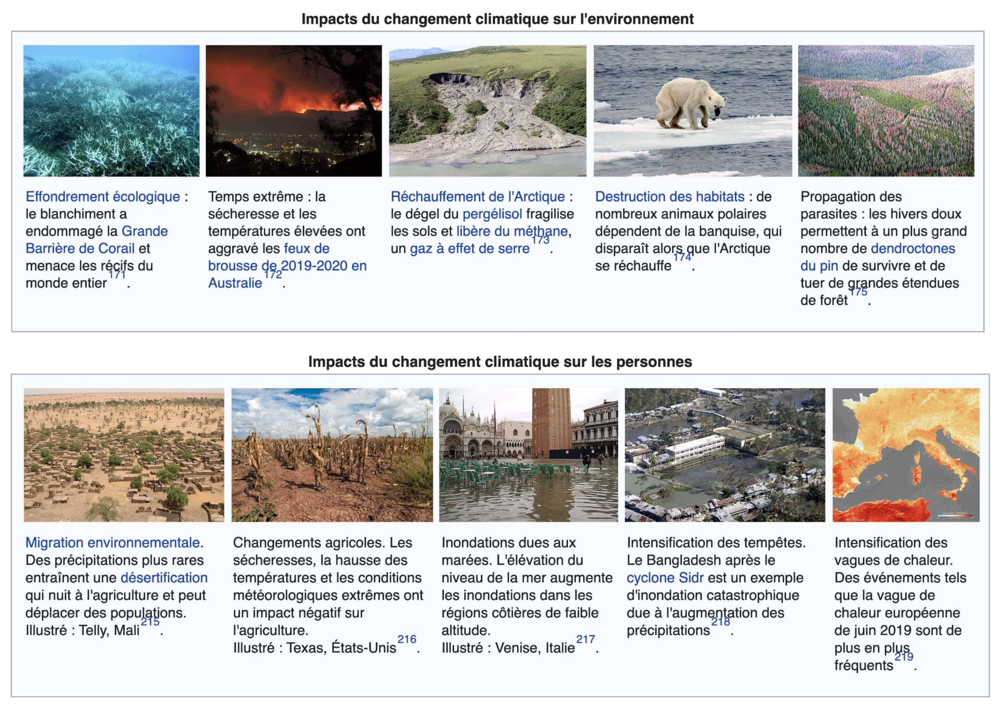

<!-- _class: titre -->

# Q2b – Comment la réflexion peut-elle nous guider moralement ?

Cédric Eyssette (2022-2023)
https://eyssette.github.io/

---
<!-- _class: i1t1 vertical -->

#### Le dilemme du tramway

<!-- 
https://photos.google.com/share/AF1QipPPfbUkTBXiHp4v_f2w1s7rO70wTBpButb8zOzUDxWelwUJr5emIEucfTlt3yc7lA?key=djQzRTFJa05jNnR6Mk9FV09YcWdwVWhPbGNFWW53

https://docs.google.com/document/d/14JTNcMAKF95SZn66McfHrrX9kOgKRwjBJqPQQe_3tpA/edit?userstoinvite=vincentvejdovsky%40gmail.com&actionButton=1

https://ladigitale.dev/digiplay/#/v/637735a7702aa
 -->

---
<!-- _class: partie -->
# I – La morale requiert  une réflexion sur  les conséquences <!-- fit -->
Première partie

---
<!-- _class: citationC fppp -->

>« L'objet que nous nous proposons dans cet ouvrage, c'est de faire ressortir les rapports qui unissent l’intérêt au devoir dans toutes les choses de la vie […] [Q]u'est-ce que la vertu ? C'est ce qui contribue le plus au bonheur, ce qui maximise les plaisirs et minimise les peines. Le vice, au contraire, c'est ce qui diminue le bonheur et contribue au malheur. »
>>**Bentham**, _Déontologie, ou Science de la morale_, t.I 

---
<!-- _class: souspartie -->

## A. Une finalité

Il faut viser un maximum de bonheur et un minimum de souffrances pour le plus grand nombre

---
<!-- _class: souspartie -->

## B. Une méthode

Il faut faire un calcul des conséquences de nos choix

---
<!-- _class: etape -->

### 1/ Ce calcul doit être le plus objectif possible

1) Il faut éviter d'être dogmatique
2) Il faut faire un examen empirique des conséquences

---
<!-- _class: citationC fmmmmmm -->

>«  [I]l est malheureux que les hommes abordent la discussion de questions importantes, déterminés d'avance sur la solution qu'ils leur donneront. On dirait qu'ils se sont préalablement engagés envers eux-mêmes à trouver bons certains actes, certains autres mauvais. Mais [il ne faut point admettre] ces décisions péremptoires. Avant de condamner un acte, il [faut] que son incompatibilité avec le bonheur des hommes soit démontrée. De telles investigations ne conviennent point à l'instructeur dogmatique. […] Pour soutenir son opinion, il fera de cette opinion un principe. « Je proclame que ces choses ne sont pas bien, dit-il avec une dose suffisante d'assurance, donc elles ne sont pas bien. » […] Que devient alors la tâche du moraliste ? Il peut mettre sous les yeux de celui qui l'interroge un aperçu des probabilités de l'avenir, plus exact et plus complet qu'il ne se serait offert à ses regards au milieu des influences du moment. »
>>**Bentham**, _Déontologie, ou Science de la morale_, t.I 

---
<!-- _class: citationC fmm -->

>« [P]our être véritablement utile, il faut [que le moraliste] aille à la découverte des conséquences qui doivent résulter d'une action donnée ; il faut qu'il les recueille le mieux qu'il le pourra […]. La valeur des peines et des plaisirs peut être estimée par leur intensité, leur durée, leur certitude, leur proximité et leur étendue. Leur intensité, leur durée, leur proximité et leur certitude regardent les individus. Leur étendue concerne le nombre des personnes placées sous leur influence. Ce que certaines de ces qualités ont en plus, peut contre-balancer ce que certaines autres ont en moins. »
>>**Bentham**, _Déontologie, ou Science de la morale_, t.I 

---
<!-- _class: i1t1 pp -->

Les politiques de réduction des risques liés aux drogues

---
<!-- _class: i1t1 pp -->

L'homoparentalité

---
<!-- _class: etape -->

### 2/ Ce calcul doit être global

1) Il faut aussi prendre en compte les conséquences lointaines et indirectes, et les conséquences de ce que nous ne faisons pas
2) Il faut prendre en compte tous les êtres qui peuvent subir les conséquences de nos choix

---
<!-- _class: i1t0 pp-->

---
<!-- _class: i2t1 pp rapprocher-->

La défense d'un devoir de donner de l'argent à des associations humanitaires efficaces

---
<!-- _class: i1t1 pp -->

La critique de la production industrielle de viande

<!-- Ajouter : expérimentation animale : les 3R -->

<!-- Ajouter : slide sur les limites des morales des conséquences : 
1. Calcul complexe, difficile voire impossible
peut conduire à l'irrésolution, au scepticisme moral
2. Les personnes sont réduites à de simples paramètres dans un calcul global
question de la légitimité de sacrifice de certains au profit d'un bien global -->

<!-- Ajouter : dilemme du tramway ? -->

---
<!-- _class: i1t0 pp -->

---
<!-- _class: partie -->
# II – La morale requiert une réflexion sur les principes
Deuxième partie

---
<!-- _class:  -->
#### &rarr; Les morales déontologiques

Un exemple de morale déontologique : la philosophie morale de Kant

---
<!-- _class: souspartie -->

## A. Un principe

Agir moralement, ce n'est pas agir par intérêt ou pour une satisfaction personnelle.

C'est agir par devoir.

<!-- 
agir par devoir : c'est agir d'après un impératif catégorique

impératif hypothétique / impératif catégorique -->

---
<!-- _class: -->
#### Une précision :

Agir par devoir ≠ agir conformément au devoir.

---
<!-- _class: fp -->

Quelques exemples d'actions qui semblent morales, mais qui sont guidées par l'intérêt :
1) Être honnête pour garder ses clients
2) Agir par crainte du regard d'autrui, agir par crainte de la sanction 
3) Agir par désir de reconnaissance sociale, agir pour avoir une bonne réputation
4) Agir comme Valmont, dans _Les liaisons dangereuses_ ([lettres 21 et 22](https://docs.google.com/document/d/178hLNAjuEX5eUXoIM88Hy3RqXbbVJPJx6SDuK5Aao24/edit)), qui se donne l'apparence de la vertu pour séduire une femme sensible aux actions morales.

<!--
greenwashing
donner de l'argent à des associations humanitaires pour payer moins d'impôts -->

---
<!-- _class: souspartie  -->

## A. Une méthode

Il faut réfléchir à ce qui guide mon action.

---
<!-- _class:  -->

&rArr; La morale ne consiste pas à suivre une **autorité** extérieure qui me dit ce que je dois faire. Le devoir moral est une expression de notre **autonomie**.

<!-- morale hétéronome -->

<!-- l’autonomie ne signifie pas que chaque individu a sa morale propre et que chacun choisit les normes qu’il veut respecter en fonction de ses désirs, de ses préférences
Le devoir moral n’est pas relatif, il ne varie pas selon les individus et leurs préférences, il vaut de manière universelle
-->

&rArr; La morale n'est pas une **contrainte** extérieure à notre liberté, mais une **obligation** que je reconnais intérieurement

---
<!-- _class: etape -->

### 1/ Ce qui guide mon action  ne doit pas être un raisonnement  valable seulement de mon point de vue <!-- fit -->

1) Agir moralement ≠ se considérer comme une exception
2) = agir d'après une règle universalisable

<!-- égoïsme, égocentrisme / moi je
Le "connard"
-->

<!-- « Agis uniquement d’après la maxime qui fait que tu puisses vouloir en même temps qu’elle devienne une loi universelle » (ou également : « Agis comme si la maxime de ton action devait être érigée par ta volonté en loi universelle de la nature ») -->

---
<!-- _class:  -->
Pour savoir ce qui est moral, il faut faire un **test d'universalisation** de notre action : si je fais le choix d'agir ainsi, alors puis-je accepter que tout le monde fasse comme moi ?

<!-- Pas un calcul complexe des conséquences comme dans le conséquentialisme -->

---
<!-- _class: i1t1 vertical fppppppp -->

#### Exemple 1 : le mensonge

---
<!-- _class: i1t1 vertical fppppppp -->

#### Exemple 2 : la tricherie à un examen

---
<!-- _class:  -->
Le test d'universalisation ressemble en apparence à ce qu'on appelle **la règle d'or** en morale ("ne fais pas à autrui ce que tu n'aimerais pas qu'il te fasse").

<!-- en commun : dépassement du point de vue de la première personne ; dépassement de l'égocentrisme -->

Mais le test d'universalisation est plus général et repose davantage sur l'idée que la morale est une question de cohérence rationnelle.

<!-- limites de la règle d'or : 
- repose sur les désirs, les préférences de l'individu
- logique seulement interindividuelle (qu'il me fasse), logique de la réciprocité (et si c'était lui qui me le faisait)
-->

<!-- pas une simple cohérence interne, mais une cohérence au sens large -->

---
<!-- _class: etape -->

### 2/ Ce qui guide mon action  ne doit pas être un raisonnement  instrumental à la recherche du meilleur  moyen d'accomplir mes fins <!-- fit -->

1) Agir moralement ≠ traiter les autres comme de simples moyens
2) = respecter la dignité des autres

<!-- « Agis de telle sorte que tu traites l’humanité aussi bien dans ta personne que dans la personne de tout autre toujours en même temps comme une fin, et jamais simplement comme un moyen » -->

---
<!-- _class:  -->
Un être humain est :

1) une personne, et non une chose
2) un sujet autonome, capable de faire des choix et non un objet qu'on utilise comme on veut

<!-- Lien avec importance de la notion de consentement
-->

---
<!-- _class: cinema fmmmm-->

>Dans le film _Le Loup de Wall-Street_, Jordan Belfort, un trader, téléphone à des personnes peu aisées qui veulent placer leurs maigres économies, et leur ment sur la valeur des actions qu'il leur propose (« _I was selling them shit_ »). Ces personnes ne sont pour lui qu'un simple moyen de gagner plus d'argent : il les méprise et les considére comme de vulgaires bouseux. Vers la fin du film, quand sa femme lui annonce qu'elle veut divorcer, il ne la voit plus que comme un obstacle entre lui et ses enfants qu'il veut garder avec lui. Il devient violent jusqu'à la frapper dans l'estomac.

---
<!-- _class: cinema fmmmm-->

>Dans le film _Mesure d'urgence_, un médecin kidnappe des personnes sans abri afin de faire des expérimentations médicales sur eux, dans le but de trouver un remède contre des maladies pour le moment incurables. Il affirme que la vie de ces individus n'a pas beaucoup de sens : leur mort était de toute façon prévisible ; autant faire en sorte qu'elle soit utile ! Un grand médecin a, selon lui, le courage d'outrepasser les règles ordinaires : il serait légitime de sacrifier quelques vies sans significations, si cela permet d'améliorer de manière importante la vie d'un grand nombre de personnes.

---
<!-- _class: fpppp -->
La notion de dignité désigne la **valeur intrinsèque** (en lui-même) de tout être humain.

<!-- un être qui a une valeur intrinsèque (en lui-même) et non pas une simple valeur instrumentale (pour faire quelque chose). -->

Elle implique une **égalité fondamentale** de tous les êtres humains. La dignité ne dépend pas des talents personnels ou du statut social. 

<!-- on retrouve ici le fait de ne pas se considérer comme une exception

Lien avec extrait de Mesure d'urgence : il n'y a pas des êtres qui valent moins que les autres
-->

La dignité est **inconditionnelle et absolue** : aucun acte, aucune circonstance ne peuvent justifier de ne pas respecter la dignité d'autrui.

<!-- Notamment :
interdit de la torture

Lien avec extrait de Mesure d'urgence : le bénéfice de l'utilisation d'humains non consentants ne peut pas être considéré comme un argument

Permet de dépasser l'objection du sacrifice contre le conséquentialisme
-->

<!-- + limite : ambiguïté de la notion de dignité (faire schéma) ?
avec exemple du lancer de nain

Ne pas utiliser comme un simple moyen / ne pas traiter comme une chose
Respecter l'autonomie de la personne

-->

---
<!-- _class: i1t0 pp -->

---
<!-- _class: partie -->
# Mise en  pratique <!-- fit -->

---
<!-- _class: exercice application fmmmmm -->

### Exercice d'application

- Choisir un sujet ci-dessous :
	- Peut-on fonder la morale sur la recherche du bonheur ?
	- Faut-il se fier à ses sentiments pour agir moralement ?
	- La morale peut-elle se passer d’un fondement religieux ?
	- En morale, y a-t-il des certitudes ?
	- Le progrès technique peut-il conduire à de nouveaux problèmes moraux ?
	- La conscience morale n’est-elle que le résultat de l’éducation ?
	- En politique, a-t-on le droit de sacrifier la morale à l’efficacité ?
	- Respecter autrui, est-ce respecter sa différence ?
- Rédiger une sous-partie de dissertation (autour de 300 mots)  :warning:  il faut défendre une seule réponse, mobiliser le cours, et utiliser le modèle _ARES_