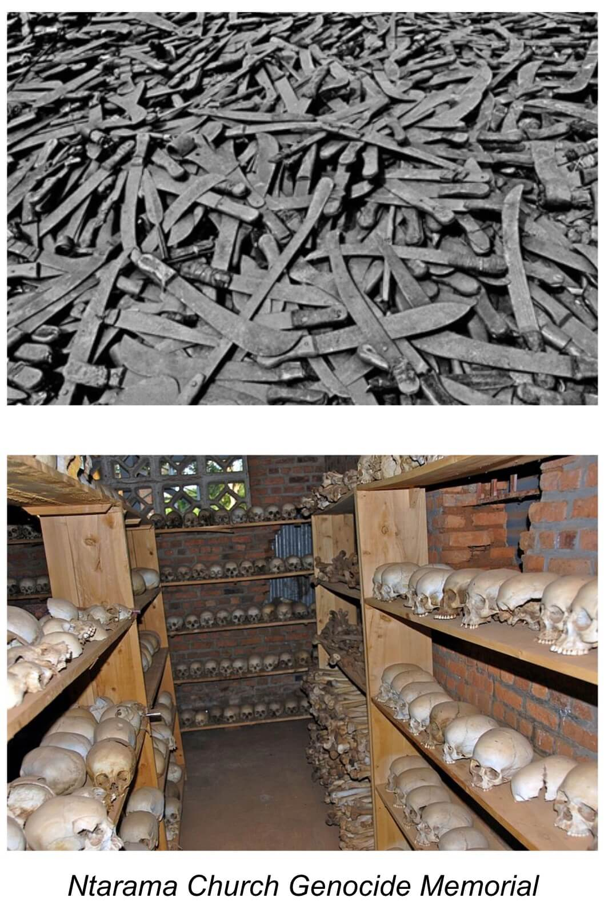

<!-- _class: partie -->

# II – Une connaissance morale est possible, fondée avant tout sur la sensibilité à la souffrance d'autrui
Deuxième partie

---
<!-- _class: souspartie -->

## A. Les arguments contre la possibilité d'une connaissance morale sont critiquables

---
<!-- _class: etape -->
### 1/ Le relativisme culturel est critiquable

---
<!-- _class: i1t2 fmmmmmm  -->

### Les “hyènes” du Malawi

Dans certaines communautés du Malawi, malgré l’interdiction légale depuis 2003, subsiste encore un rituel de purification sexuelle (_kusasa fumbi_) : dès les premières règles d'une jeune fille, lors du décès d’un conjoint, ou pour construire une nouvelle maison, les familles malawites font appel à une “hyène” (un _fisi_). Ils paient un homme, dont c'est officieusement le “métier”, pour “purifier” le corps de leur fille ou de la femme par une relation sexuelle non consentie ni protégée.

---
<!-- _class: i1t2 fmmmmmmmmmm   -->

### Les mutilations génitales féminines (l'excision)

« Les mutilations génitales féminines recouvrent toutes les interventions incluant l'ablation partielle ou totale des organes génitaux externes de la femme ou toute autre lésion des organes génitaux féminins qui sont pratiquées pour des raisons non médicales. […] Les mutilations sexuelles sont pour la plupart pratiquées sur des jeunes filles entre l'enfance et l'adolescence et à l'occasion sur des femmes adultes. Plus de 3 millions de jeunes filles par an sont menacées par ces pratiques. Plus de 200 millions de jeunes filles et de femmes sont victimes de mutilations sexuelles pratiquées dans 30 pays africains et du Moyen Orient où ces pratiques sont concentrées. » ([Site de l'OMS](https://www.who.int/fr/news-room/fact-sheets/detail/female-genital-mutilation))

---
<!-- _class: i1t0 pp -->

---
<!-- _class: etape -->
### 2/ Le fait que les jugements moraux  soient associés à des sentiments ne rend  pas impossible la connaissance morale <!-- fit -->

---
<!-- _class:  -->

Deux arguments :

1) De manière générale, un sentiment peut être justifié objectivement.
2) Un jugement moral ne se réduit pas à l'expression d'un sentiment : c'est aussi l'expression d'une idée qui peut être jugée fausse si elle n'est pas en accord avec certains principes.

---
<!-- _class: souspartie -->

## B. La sensibilité à la souffrance d'autrui rend possible une première forme de connaissance morale
C'est la thèse des morales de la sensibilité

---
<!-- _class: etape -->
### 1/ La notion de pitié chez Rousseau

---
<!-- _class: citationC fm -->

>« [L]a pitié, disposition convenable à des êtres aussi faibles, et sujets à autant de maux que nous le sommes [est une] vertu d’autant plus universelle et d’autant plus utile à l’homme qu’elle précède en lui l’usage de toute réflexion, et si naturelle que les bêtes mêmes en donnent quelquefois des signes sensibles. […] [D]e cette seule qualité découlent toutes les vertus sociales […] la générosité, la clémence, l’humanité » 
>>**Rousseau**, _Discours sur l’origine et les fondements de l’inégalité parmi les hommes_, I

---
<!-- _class: i1t0 pp -->

---
<!-- _class: etape -->
### 2/ Une notion contemporaine : le _care_

---
<!-- _class: i1t0 pp -->

---
<!-- _class: cinema fmmm -->

>Dans le film de Ken Loach _Moi, Daniel Blake_, un menuisier anglais de 59 ans, Daniel Blake, se retrouve, après un accident cardiaque, dans l'incapacité de travailler. Mais il se heurte à un système social devenu absurde qui lui réclame de chercher malgré tout un emploi. Il se lie d'amitié avec Katie, une jeune mère qui élève seule ses enfants, sans argent, sans emploi, elle aussi confrontée à des exigences administratives absurdes. Tous deux chercheront à prendre soin l'un de l'autre.

---
<!-- _class: etape -->
### 3/ Le mal semble en partie s'expliquer par l'absence d'empathie

---
<!-- _class: i1t2 fmmmmmmmmm contain  -->

### Le cas Eichmann

En 1960, le responsable SS du transport des prisonniers juifs dans l’Allemagne nazie, Adolf Eichmann, est arrête et jugé. Lors de son procès, Eichmann se présente comme « un modeste et petit fonctionnaire », simple « rouage » de la machine nazie. C’est donc le spécialiste de la logistique qui parle : « Je ne m’occupais que des horaires. Si un convoi ne partait pas à l’heure et au jour prévus, l’ensemble du système était démoli. » Autre morceau choisi, cette fois sur l’envoi de six convois d’enfants juifs français. « Puisqu’il s’agissait de déporter tous les juifs, il fallait bien y inclure les enfants. On a l’impression que je me suis acharné sur les enfants. En fait, cela était logique. » L’accusé parle sans aucune émotion. Il semble que ces enfants n’ont jamais troublé sa conscience.

---
<!-- _class: i1t2 fmmmmmmmmmmm contain pp -->

### La lettre de Willy Just

Extrait : « _Objet :_ Modifications techniques à apporter aux camions spéciaux actuellement en service et à ceux qui sont en cours d’aménagement.
Depuis décembre 1941, par exemple, on en a traités 97 000 avec trois voitures dont le fonctionnement n’a révélé aucun défaut. […]
Au cours d’une discussion avec la firme chargée des aménagements, celle-ci a fait remarquer qu’un raccourcissement de la superstructure entraînerait l’inconvénient d’un déplacement du poids vers l’avant. L’axe avant risquerait ainsi d’être surchargé. En réalité, il se produit une compensation spontanée dans la répartition du poids, du fait que, lors du fonctionnement, le chargement, dans les efforts qu’il fait pour se rapprocher de la porte arrière, s’y trouve toujours pour la plus grande partie. […]
Pour permettre un nettoyage commode du véhicule, on pratiquera au milieu du plancher une ouverture permettant l’écoulement. Elle sera fermée par un couvercle étanche de vingt à trente centimètres de diamètre permettant l’écoulement des liquides fluides en cours de fonctionnement. […] »

---
<!-- _class: i1t2 fmmmmmmm contain pp -->

### Le génocide des Tutsis au Rwanda

Pour masquer la réalité du meurtre d'êtres humains et écarter toute attitude empathique, les Hutus ont employé à propos des Tutsis la métaphore bestiale (cancrelats, poux, rats, vermines). Le mécanisme consiste à chosifier les autres, à les déshumaniser, à ne plus les considérer comme partageant une même capacité de penser, de ressentir.
La pratique du massacre emprunte des mots à des activités diverses  (la chasse, le travail, le nettoyage) pour banaliser l'atrocité et la faire disparaître derrière des notions positives comme la solidarité des chasseurs à la poursuite d'un gibier, le travail agricole de débroussaillage des collines, ou encore la notion de propreté lorsqu'il s'agit de « nettoyer un secteur ».

---
<!-- _class: i2t1 pp-->

### L'expérience de Milgram

---
<!-- _class: pp -->

### Les variantes de l'expérience de Milgram

<iframe width="916" height="612" seamless frameborder="0" scrolling="no" src="https://docs.google.com/spreadsheets/d/e/2PACX-1vT64S9DrpXT_pYPP_NR3bobzG36shhSZ-kqWRJIkNVlhh2zeuf2essMPpHBd0ohomqR8786fKeunqeT/pubchart?oid=1624266486&amp;format=interactive"></iframe>

---
<!-- _class: exercice application fmmmmm -->

### Exercice d'argumentation et de mobilisation de sa culture

- Choisir un sujet et rédiger l'équivalent d'une sous-partie (250-350 mots), de préférence avec le modèle _ARES_ : Attention : il faut développer une seule réponse avec un seul argument, et mobiliser ses connaissances (concept, référence, exemple) sur la critique du relativisme culturel et les morales de la sensibilité
    - La morale s'apprend-elle ?
    - Peut-on s’accorder sur des vérités morales ?
    - Faut-il se fier à ses sentiments pour agir moralement ?
    - N’est-on moral que par intérêt ?
    - La culture est-elle un obstacle à la barbarie ?
    - Avons-nous des devoirs envers les animaux ?
    - La technique peut-elle transformer la morale ?
    - La connaissance d'autrui est-elle possible ?
