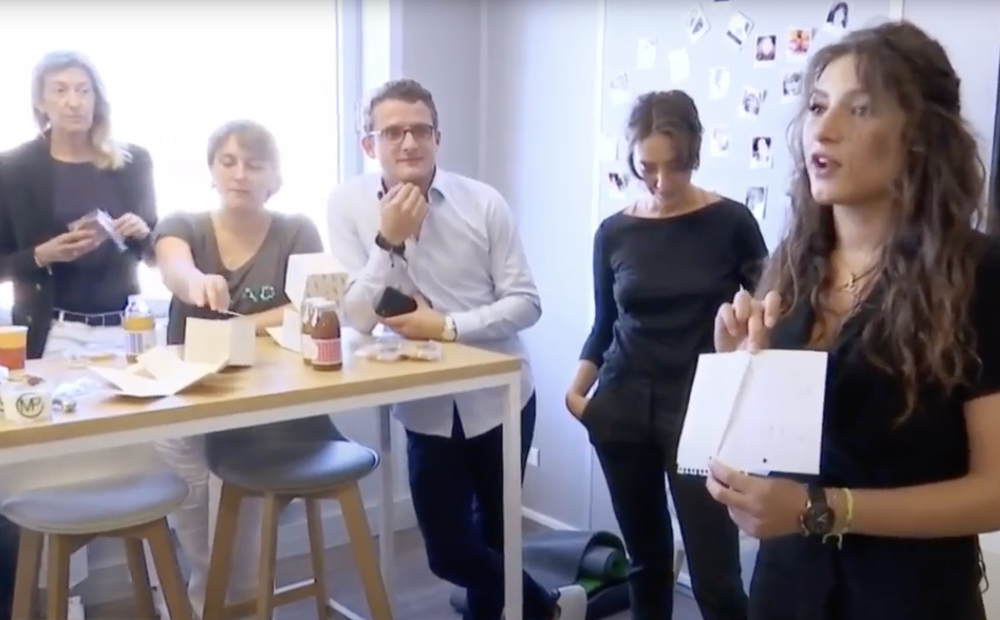
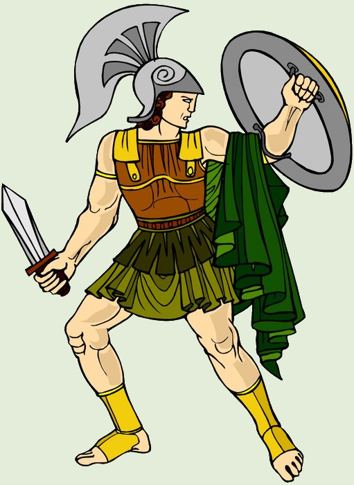
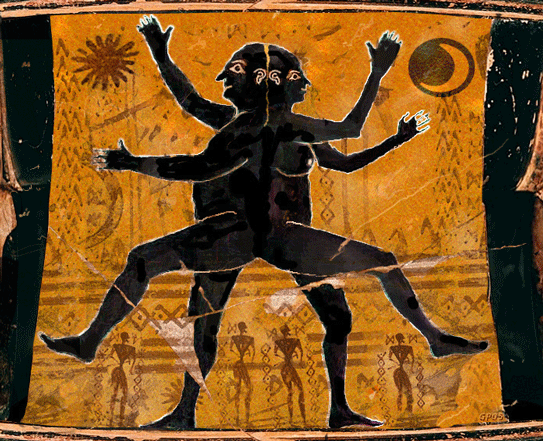
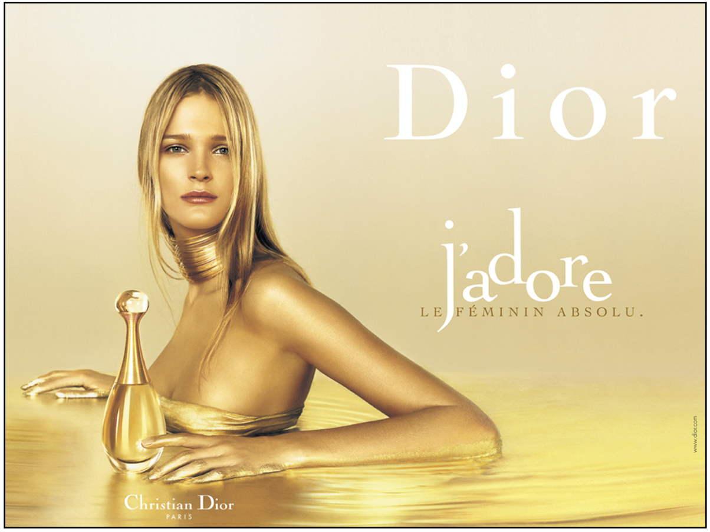
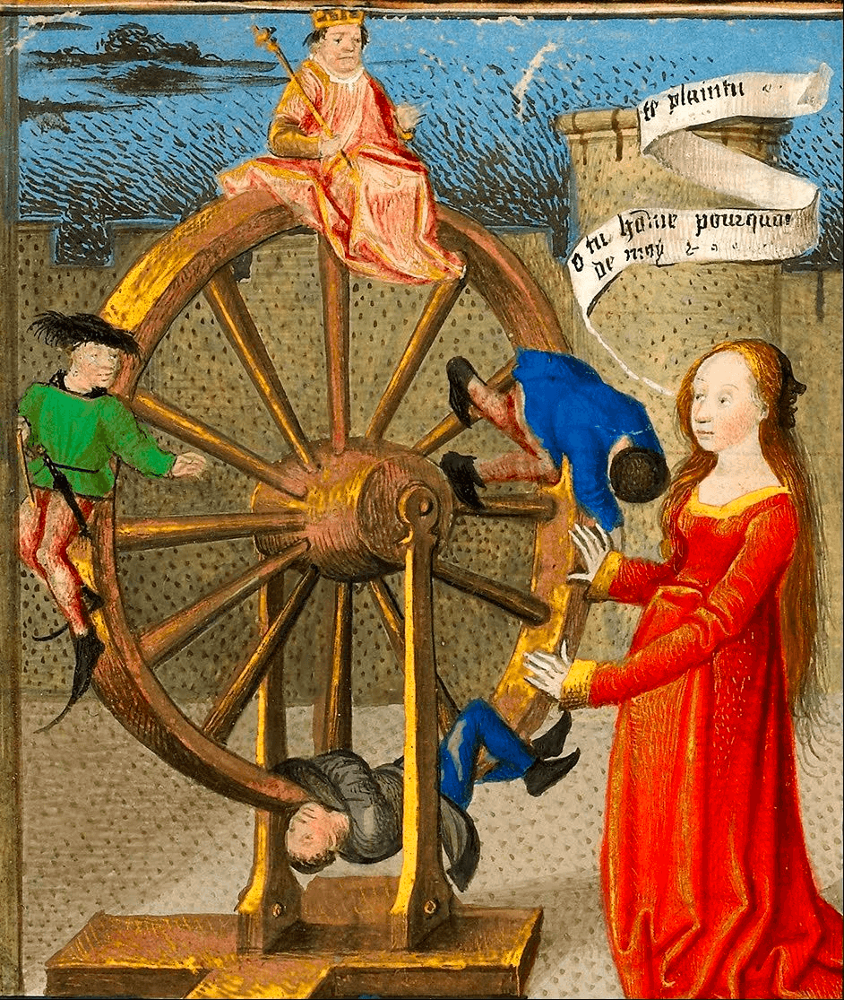

<!-- _class: partie pm -->

# I – Le bonheur  semble être une  quête impossible
Première partie

---
<!-- _class: pointmethode fpppppp -->
### Point méthode
Pour qu'il y ait une progression logique dans son plan, on peut partir de l'idée qui nous semble la moins convaincante, pour aller vers des idées qui nous semblent plus pertinentes.

---
<!-- _class: souspartie -->
## A. On ne sait pas vraiment ce qu'on recherche

---
<!-- _class: etape -->
### 1/ Référence : Kant
- Quelle est l'idée de Kant dans le texte que vous avez étudié ?

---
<!-- _class: citationC -->

>« Le bonheur est un idéal, non de la raison, mais de l’imagination ».
>>**Kant**, _Fondements de la Métaphysique des Mœurs_, 2e section

---
<!-- _class: exercice tableau fmm -->

|Une conception du bonheur n'est jamais …|Une conception du bonheur est toujours …|
|:-:|:-:|
|?|?|
|?|?|
|?|?|

1. un savoir objectif et universel
2. une image vague et confuse 
3. une méthode infaillible 
4. une représentation subjective et particulière
5. un concept précis et clair
6. une projection incertaine qui n'est pas à l'abri de la déception

---
<!-- _class: exercice tableau-r fp-->

|Une conception du bonheur n'est jamais …|Une conception du  bonheur est toujours …|
|:-:|:-:|
|*1* un savoir objectif  et universel|*4* une représentation  subjective et particulière|
|*5* un concept  précis et clair|*2* une image  vague et confuse|
|*3* une méthode infaillible|*6* une projection incertaine qui n'est pas  à l'abri de la déception|

---
<!-- _class: etape -->
### 2/ Exemples

---
<!-- _class: i1t1 horizontal pp  -->

>« Au milieu des années 1950, April et Frank Wheeler forment un jeune couple américain qui, en apparence, a tout pour être heureux (enfants, maison, travail...) […] ils finissent par devenir tout ce qu'ils ne voulaient pas être : un homme coincé par son métier et dont la désinvolture peine à cacher le manque d'assurance et une femme au foyer morose rêvant d'une autre vie. » ([source](https://fr.wikipedia.org/wiki/Les_Noces_rebelles)).

---
<!-- _class: i2t0 pp contain-->

---
<!-- _class: i1t1 fp vertical pp-->

- Aimeriez-vous qu'il y ait une personne qui s'occupe de votre bonheur, en tant que _Chief Happiness Officer_ dans votre entreprise  ? Qu'en penserait Kant ?

---
<!-- _class: definition fppp-->

### Définitions

- Le **paternalisme** consiste à prétendre savoir ce qui est bon pour autrui et à vouloir faire le bien des autres, sans tenir compte de leur avis.
- Une **conception normative du bonheur** est une conception du bonheur qui prétend qu'il y a une règle déterminée qu'il est nécessaire de suivre afin de parvenir au bonheur.

---
<!-- _class: entete approfondissement f-->

### Approfondissement

1. Lire cet [article sur l'injonction au bonheur](https://www.lemonde.fr/m-perso/article/2016/05/27/le-retour-de-la-mere-parfaite_4927830_4497916.html) que véhiculent les “mères parfaites” sur Instagram
2. Regarder la vidéo de la chaîne _Méta_ sur [la dictature du bonheur](https://www.youtube.com/watch?v=oqq96UQAaXo)
3. Consulter ce lien sur [le bonheur comme norme sociale et économique](https://docs.google.com/document/d/1Bo9T9oGNag4bkaGGVzyd5i-DDI19vf0smo-qq60H0_M/edit?usp=sharing)
3. Lire le livre [Happycratie d'Eva Illouz](https://laviedesidees.fr/Bonheur-obligatoire.html), ou bien seulement des extraits sélectionnés (me les demander)
4. Découvrir l'[analyse critique du développement personnel par Julia de Funès](https://www.arte.tv/fr/videos/092170-010-A/philosophie/)

---
<!-- _class: exercice application pm -->

### Exercice d'argumentation et de mobilisation de sa culture

- Rédiger un paragraphe (150 mots minimum), qui répond à l'un de ces sujets, avec un argument qui mobilise le cours sur Kant, en utilisant le modèle _ARES_ :
  - Le bonheur est-il une affaire privée ?
  - Suffit-il de réaliser ses désirs pour être heureux ?
  - Ai-je le devoir de faire le bonheur des autres ?
  - Le bonheur dépend-il de nous ?

---
<!-- _class: pointmethode fpppp -->

### Point méthode

Pour structurer un paragraphe, on peut utiliser le modèle **ARES** :

–  A : Argument
–  R : Référence théorique
–  E : Exemple concret
–  S : Synthèse

---
<!-- _class: etape pm fppppppppp-->

### Fin de sous-partie

Mais est-ce seulement en raison de la nature, indéterminée, du bonheur que la quête du bonheur est une quête impossible ? N'y a-t-il pas aussi des obstacles, en nous et hors de nous, qui empêchent de parvenir au bonheur ?

---
<!-- _class: pointmethode -->

### Point méthode

En fin de sous-partie, on s'efforce de faire une transition, de préférence sous la forme d'une question, afin d'expliquer la progression logique de son argumentation.

---
<!-- _class: souspartie -->
## B. Le désir est insatiable

---
<!-- _class: etape -->
### 1/ Le désir comme manque

---
<!-- _class: citationC -->

>« Tout vouloir naît du besoin, donc du manque, donc de la souffrance »
>>**Schopenhauer**, _Le Monde comme volonté et comme représentation_, Livre III, §38

---
<!-- _class: i1t1 vertical  -->

Le mythe d'Aristophane

---
<!-- _class: etape -->
### 2/ L'image du tonneau percé

---
<!-- _class: citationC fpppppp-->

>« [L]e sujet du vouloir […] remplit éternellement le tonneau des Danaïdes »
>>**Schopenhauer**, _Le Monde comme volonté et comme représentation_, Livre III, §38

---
<!-- _class: i1t0 pp -->

---
<!-- _class: fp -->

### L'image du tonneau percé

1) Nous aimerions tous avoir un **tonneau plein**
2) Mais le tonneau n'est pas plein : il y a **du vide** dans le tonneau
3) Nous essayons de **remplir le tonneau** en versant des bonnes choses dans le tonneau
4) Le problème est que nous avons un **tonneau percé**
5) Donc, quand on remplit le tonneau, il **se vide rapidement**
6) Nous sommes ainsi condamnés à verser sans cesse, sans **jamais arriver à un tonneau plein**

---
<!-- _class: fmmmmmmmmm pp -->

|Image|Signification|
|:-:|:-:|
|Nous aimerions tous avoir un tonneau plein|Nous recherchons tous le bonheur comme état de plénitude|
|Mais le tonneau n'est pas plein : il y a du vide dans le tonneau|Mais il y a en nous, un état de manque, un état d'insatisfaction|
|Nous essayons de remplir le tonneau en versant des bonnes choses dans le tonneau|Nous cherchons à combler ce manque en satisfaisant nos désirs|
|Le problème est que nous avons un tonneau percé|Le problème est que nous désirons toujours plus (= la pléonexie)|
|Donc, quand on remplit le tonneau, il se vide rapidement|La satisfaction est donc temporaire : nous retombons vite dans l'insatisfaction|
|Nous sommes ainsi condamnés à verser sans cesse, sans jamais arriver à un tonneau plein|Nous sommes condamnés à un cycle sans fin d'insatisfactions, qui ne permet pas de parvenir au bonheur (à une satisfaction globale et durable)|

---
<!-- _class: etape -->
### 3/ Exemples

---
<!-- _class: citationL fmmm -->

>« Je suis publicitaire: eh oui, je pollue l’univers. Je suis le type qui […] vous fait rêver de ces choses que vous n’aurez jamais. Ciel toujours bleu, nanas jamais moches, un bonheur parfait, retouché sur PhotoShop. Images léchées, musiques dans le vent. Quand, à force d’économies, vous réussirez à vous payer la bagnole de vos rêves, celle que j’ai shootée dans ma dernière campagne, je l’aurai déjà démodée. J’ai trois vogues d’avance, et m’arrange toujours pour que vous soyez frustré. Le Glamour, c’est le pays où l’on n’arrive jamais. Je vous drogue à la nouveauté, et l’avantage avec la nouveauté, c’est qu’elle ne reste jamais neuve. Il y a toujours une nouvelle nouveauté pour faire vieillir la précédente. Vous faire baver, tel est mon sacerdoce. Dans ma profession, personne ne souhaite votre bonheur, parce que les gens heureux ne consomment pas.
Votre souffrance dope le commerce. Dans notre jargon, on l’a baptisée « la déception post-achat ». Il vous faut d’urgence un produit, mais dès que vous le possédez, il vous en faut un autre. […] Mais pour créer des besoins, il faut attiser la jalousie, la douleur, l’inassouvissement : telles sont mes munitions. Et ma cible, c’est vous. »
>>Frédéric **Beigbeder**, _99F_

---
<!-- _class: i1t0 pp -->

---
<!-- _class: entete approfondissement -->
### Approfondissement

1. Lire cette [analyse très précise de la publicité de Dior](https://eyssette.github.io/blog/assets/pdf/ancien_blog/1_ethique_et_philosophie_morale/2007_2008_analyse_dior.pdf)
2. Faire l'analyse d'une image publicitaire
3. Découvrir l'analyse que Baudrillard propose de la société de consommation sur le site Philitt : « [Baudrillard ou le triomphe du superflu](https://philitt.fr/2014/10/23/baudrillard-ou-le-triomphe-du-superflu/) »

---
<!-- _class: i1t1 pp fpppppp-->

[Extrait 1](https://youtu.be/uUlJarbHrMU?t=493) : les techniques de rétention dans Fortnite

[Extrait 2](https://youtu.be/uUlJarbHrMU?t=2353) : les réseaux sociaux et l'économie de l'attention

---
<!-- _class: exercice application fm -->

### Exercice d'argumentation et de mobilisation de sa culture

- Rédiger un paragraphe (150 mots minimum), qui répond à l'un de ces sujets, avec un argument qui mobilise le cours sur Schopenhauer, en utilisant le modèle _ARES_ :
  - Le progrès technique rend-il heureux ?
  - Peut-on désirer sans souffrir ?
  - Le bonheur n'est-il qu'une illusion ?
  - Le désir est-il la marque de notre imperfection ?
  - Le désir peut-il se satisfaire de la réalité ?

---
<!-- _class: souspartie fpppp-->

## C. Le tragique de l'existence nous condamne au malheur

- Qu'est-ce que le « tragique » à votre avis ?
- Qu'est-ce que cela veut dire quand on dit que « l'existence est tragique » ?

---
<!-- _class: etape -->
### 1/ Première forme de tragique : le tragique de l'impuissance

---
<!-- _class: i1t1 horizontal pp -->

- Que représente cette image ?

---
<!-- _class: citationC -->

>« Nul ne peut être dit heureux avant sa mort »
>>Adage grec attribué à **Solon**

---
<!-- _class: citationC -->

>« Le temps est comme un enfant qui joue »
>>**Héraclite**

---
<!-- _class: etape -->
### 2/ Deuxième forme de tragique : le tragique de l'insignifiance

---
<!-- _class: citationC fppp -->

>« [E]n regardant l’univers muet et l’homme sans lumière, abandonné à lui-même, et comme égaré dans ce recoin de l’univers, sans savoir qui l’y a mis, ce qu’il y est venu faire, ce qu’il deviendra en mourant, incapable de toute connaissance, j’entre en effroi comme un homme qu’on aurait porté endormi dans une île déserte et effroyable, et qui s’éveillerait sans connaître où il est, et sans moyen d’en sortir »
>>**Pascal**, _Pensées_, L.198 - B.693

---
<!-- _class: pp i1t1 vertical fpppp -->

Philippe de Champaigne, _Vanité_ (1644)

---
<!-- _class: pp i1t1 vertical fpppp -->

Pieter Claesz, _Vanité au tireur d'épine_ (1628)

---
<!-- _class: i1t1 vertical fmm -->

Nicolas Rubinstein, _Sans titre_  (série : _Mickey is also a rat_)

---
<!-- _class: i1t1 horizontal pp -->

Damien Hirst,  _For the Love  of God_

---
<!-- _class: i1t1 horizontal pp -->

James Hopkins, _Wasted Youth_

---
<!-- _class: citationC fppp -->

>« Rien n’est si insupportable à l’homme que d’être dans un plein repos […] Il sent alors son néant, son abandon, son insuffisance, sa dépendance, son impuissance, son vide. Incontinent il sortira du fond de son âme l’ennui, la noirceur, la tristesse, le chagrin, le dépit, le désespoir. »
>>**Pascal**, _Pensées_, L.622 - B.131

---
<!-- _class: etape -->
### 3/ Que pouvons-nous faire face au tragique de l'existence ?

---
<!-- _class: citationC fpppp  -->

>« Les hommes n’ayant pu guérir la mort, la misère, l’ignorance, ils se sont avisés, pour se rendre heureux, de n’y point penser. »
>>**Pascal**, _Pensées_, L.133 - B.158

> « Sans examiner toutes les occupations particulières, il suffit de les comprendre sous le divertissement. »
>>**Pascal**, _Pensées_, L.478, B.137

---
<!-- _class: i1t0 pp -->

---
<!-- _class: citationC  -->

>« [C]eux qui font sur cela les philosophes et qui croient que le monde est bien peu raisonnable de passer tout le jour à courir après un lièvre qu’ils ne voudraient pas avoir acheté, ne connaissent guère notre nature. »
>>**Pascal**, _Pensées_, L.136 - B.139

---
<!-- _class: entete approfondissement -->
### Approfondissement

1. Lire les passages des _Pensées_ de Pascal à propos du divertissement : [la liasse Divertissement](http://www.penseesdepascal.fr/Divertissement/Divertissement.php)
2. Lire ce [cours de Simone Manon sur le divertissement](https://www.philolog.fr/le-divertissement-pascal/)
3. Lire cet article de Dominique Weber, « [La fuite de soi, le masque du divertissement. Leçons pascaliennes](https://www.cairn-int.info/revue-etudes-2001-12-page-631.htm) »

---
<!-- _class: exercice application -->

### Exercice d'argumentation et de mobilisation de sa culture

- Rédiger un paragraphe (150 mots minimum), qui répond à l'un de ces sujets, avec un argument qui mobilise le cours sur Pascal, en utilisant le modèle _ARES_ :
  - Le progrès technique rend-il heureux ?
  - Le bonheur n'est-il qu'une illusion ?
  - Le désir est-il la marque de notre imperfection ?
  - Peut-on lutter contre le temps ?
  - L'oubli est-il une faiblesse ?

---
<!-- _class: fpppppp pm -->

#### Modèle pour une fin de partie

Le bonheur semble être une quête impossible en raison de la nature indéterminée du bonheur, du caractère insatiable du désir, et du tragique de l'existence. Mais, ne peut-on pas malgré tout trouver un certain art d’être heureux ? Ne pouvons-nous pas maîtriser nos désirs et affronter le tragique de l'existence ?

---
<!-- _class: pointmethode fppppppp-->

### Point méthode

En fin de partie, on fait :
1. Un bilan récapitulatif de ses arguments
2. Une transition, sous la forme d'une question : on montre que ce n'est pas si simple

---
<!-- _class: souspartie -->
## Récapitulatif général

---
<!-- _class:  -->

TODO : exercices LearningApps sur cette partie

---
<!-- _class: entete lecture  -->

### Travail sur le dossier de textes

Suite du travail sur le dossier de textes, afin de préparer la deuxième partie du cours.

- Relire les textes 4 et 5 ([lien vers le dossier](https://docs.google.com/document/d/1AOfjfy8-FKafXS_nNqscgNRvQkOb0iJSZdO2bjCU8RE/edit?usp=sharing))
- Répondre par écrit aux questions 4 et 5