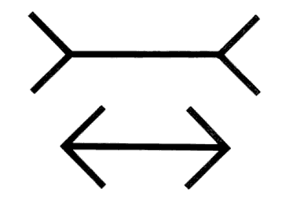

<!-- _class: titre pm-->

# Le choix libre  est-il une  illusion ?
Cédric Eyssette (2020-2021)
http://eyssette.net
<!-- Penser à donner les notions travaillées dans ce chapitre -->

---
<!-- _class: pointmethode -->
### Point méthode
En dissertation, le premier travail à faire au brouillon, c'est clarifier le sens des termes du sujet (= conceptualiser).

---
<!-- _class: souspartie -->
## A. Première étape du brouillon : analyser le sujet

---
<!-- _class: etape -->

### 1) Analyse du sujet :   « Le choix libre »
« Qu'est-ce que cela veut dire ? »

_Démarche :_ &#9679; Conceptualiser

---
<!-- _class: pm fp -->

- Quels sont les synonymes du mot “choix” et les synonymes du mot “libre” ?
- Si un choix est libre, cela veut dire que ce choix est ………
- Quel est le sens de ces expressions ? 
  - “c'est mon choix !”
  - “je n'ai pas le choix”
  - “libre comme l'air”
  - “une chute libre”
  - “un magasin en libre-service”

---
<!-- _class: pointmethode fp -->

### Point Méthode

Une première stratégie pour analyser une notion $x$ :

|Raccourci|Sens|
|:-:|:-:|
|$x \rightarrow a, b, c …$|Trouver les termes proches, les implications logiques, les expressions associées|

---
<!-- _class: etape -->

### 2) Analyse du sujet :   « une illusion »
« Qu'est-ce que cela veut dire ? »

_Démarche :_ &#9679; Conceptualiser

---
<!-- _class: i2t1 horizontal pp pm contain  -->

Illusion de Müller Lyer

Échiquier d’Adelson

---
<!-- _class: i2t0 pp -->

---
<!-- _class: entete approfondissement -->

### Approfondissement

D'autres illusions : [document sur les illusions](https://docs.google.com/document/d/1k0PyEjEYlJVcNk23j-RAzZANood-5VWihYIhd9ERlJ8/edit)

---
<!-- _class: exercice tableau colonnes fmmmmm-->

|Erreur|Illusion|
|:-:|:-:|
|?|?|
|?|?|
|?|?|
|?|?|

1. Je me trompe … 
2. Il est possible de la rectifier
3. … par la force de persuasion de mes sens, d'un biais cognitif, de mes désirs,  de l'environnement social
4. C'est une croyance sans fondement véritable, à laquelle j'adhère simplement en raison de son apparence de vérité
5. C'est une croyance fausse
6. Je suis trompé ...
7. … par manque de connaissance, de méthode, d'attention
8. Elle tend à persister : la prise de conscience ne suffit pas à la rectifier

---
<!-- _class: exercice tableau-r fmmmmm-->

|Erreur|Illusion|
|:-:|:-:|
|_1_ Je me trompe … |_6_ Je suis trompé ...|
|_7_ … par manque de connaissance, de méthode, d'attention|_3_ … par la force de persuasion de mes sens, d'un biais cognitif, de mes désirs,  de l'environnement social|
|_5_ C'est une croyance fausse|_4_ C'est une croyance sans fondement véritable, à laquelle j'adhère simplement en raison de son apparence de vérité|
|_2_ Il est possible de la rectifier|_8_ Elle tend à persister : la prise de conscience ne suffit pas à la rectifier|

---
<!-- _class: pointmethode fpp -->

### Point méthode

Deux autres stratégies pour analyser une notion : 

|Raccourci|Sens|
|:-:|:-:|
|$EC(x)$|Trouver un exemple concret, une situation concrète à propos de la notion $x$|
|$x ≠ y$|Trouver l'opposé ou des distinctions|

---
<!-- _class: pointmethode fmm -->

### Rappel 

Trois stratégies pour analyser une notion $x$ :

|Formalisation|Sens|
|:-:|:-:|
|$x \rightarrow a, b, c …$|Trouver les termes proches, les implications logiques, les expressions associées|
|$EC(x)$|Exemple concret de la notion $x$|
|$x ≠ y$|Trouver l'opposé ou des distinctions|

---
<!-- _class: souspartie -->
## B. Deuxième étape du brouillon : problématiser  le sujet

---
<!-- _class: etape -->
### 1) Reformuler le sujet  en remplaçant chaque  terme par sa définition
- Reformulez le sujet « Le choix libre est-il une illusion ? » à l'aide du travail d'analyse que l'on vient de faire.

---
<!-- _class: fppppppp -->

**Sujet initial :**
« Le choix libre est-il une illusion  ? »

**Sujet reformulé :**
« La capacité de décider de manière autonome, de sélectionner sans contraintes parmi plusieurs possibilités celle que nous préférons est-elle une illusion ? S’agit-il simplement d’une croyance sans fondement véritable ? »

---
<!-- _class: etape fpppppp -->

### 2) Dégager une tension dans le sujet, entre deux réponses opposées, en introduisant le “ou bien”
« Est-ce si simple ? »

_Démarche :_ &#9679; Problématiser

---
<!-- _class: fp pm-->

**Sujet initial :**
« Le choix libre est-il une illusion ? »

**Sujet reformulé avec le “ou bien”:**
« La capacité de décider de manière autonome, de sélectionner sans contraintes parmi plusieurs possibilités celle que nous préférons est-elle une illusion ? S’agit-il simplement d’une croyance sans fondement véritable ? Ou bien pouvons-nous affirmer que notre liberté de choisir est bien réelle et que nous ne sommes pas trompés par notre sentiment et notre désir de nous croire libres ? »

---
<!-- _class: pointmethode -->

### Point méthode
Pour problématiser un sujet de dissertation, il faut :
1. remplacer les termes par leur définition
2. introduire le “ou bien”

---
<!-- _class: exercice application f -->

### Exercice de problématisation d'un sujet de dissertation

- Problématisez le sujet suivant : « L'amour est-il une illusion ? »

Pensez à utiliser les stratégies pour analyser ce qu'est l'amour :

- $x \rightarrow a, b, c …$ : les synonymes, les implications logiques de l'amour
- $EC(x)$ : exemple concret de situation où l'on peut dire « c'est de l'amour »
- $x≠y$ : l'amour se distingue de quoi ?

---
<!-- _class: souspartie  -->
## C. Troisième étape du brouillon : trouver des idées

---
<!-- _class:  -->

#### Retour au sujet
« Le choix libre est-il une illusion ? » 

- Qu'en pensez-vous ?
- Quelles sont les différentes réponses que l'on pourrait envisager ?

---
<!-- _class:  -->

Quelques situations concrètes :

1) Une situation ordinaire : choisir à manger
2) Un film : [_Minority Report_](https://www.dailymotion.com/video/x26hp08)
3) Un jeu vidéo : [_The Stanley Parable_](https://www.youtube.com/watch?v=-JY-qtST5PY&t=963s) 

---
<!-- _class: pointmethode fppp-->

### Point méthode

Pour trouver des idées, il faut :
1) explorer la diversité des réponses possibles ;
2) justifier au maximum ces réponses : trouver des arguments, des objections, des réponses aux objections … ;
3) réfléchir à partir de situations concrètes.

---
<!-- _class: pointmethode f -->

### Point Méthode

Afin d'ouvrir les perspectives sur la question posée, deux stratégies supplémentaires :

|Formalisation|Sens|
|:-:|:-:|
|$RT(x)$|Références théoriques à propos de la notion $x$ |
|$x_{1} , x_{2} …$|Trouver différents sens de la notion $x$ |

---
<!-- _class: i1t1 pp vertical -->

### Rappel

---
<!-- _class: entete lecture  -->

### Travail sur un dossier de textes

Dossier de textes sur la question : « Le choix libre est-il une illusion ? »

- Lire les textes 1 2 et 3 ([lien vers le dossier](https://docs.google.com/document/d/1aq1ZNSFWUC6LkQMq-hnY0Wkvvi5_0N-YrQlzzAU2xtg/edit?usp=sharing))
- Répondre par écrit aux questions 1, 2 et 3 sur une feuille à part

---
<!-- _class: souspartie -->
## D. Quatrième étape du brouillon : organiser ses idées (trouver un plan)

---
<!-- _class: fmmmm pm -->

### Exemple de plan

**I - Nous sommes à première vue capables de faire des choix libres : ce n'est pas une illusion** 

A. On peut distinguer les actes volontaires et les actes involontaires
B. Notre capacité de penser nous permet d'envisager plusieurs possibilités

**II – Nos choix semblent en fait déterminés par des causes que nous ne maîtrisons pas**

A. Il est possible que la source de mes actes se trouve dans des facteurs dont je n'ai pas conscience
B. Les sciences humaines semblent montrer que nos choix sont déterminés par différents types de facteurs

_…… (Troisième partie : à  suivre)_

---
<!-- _class: fp pointmethode -->

### Point méthode

**Trois principes pour le plan**
1) On fait 2 (ou 3) parties : chaque partie est l'examen d'une réponse à la question posée.
2) On fait 2 à 4 sous-parties : chaque sous-partie est un argument.
3) Il doit y avoir une progression logique dans le devoir