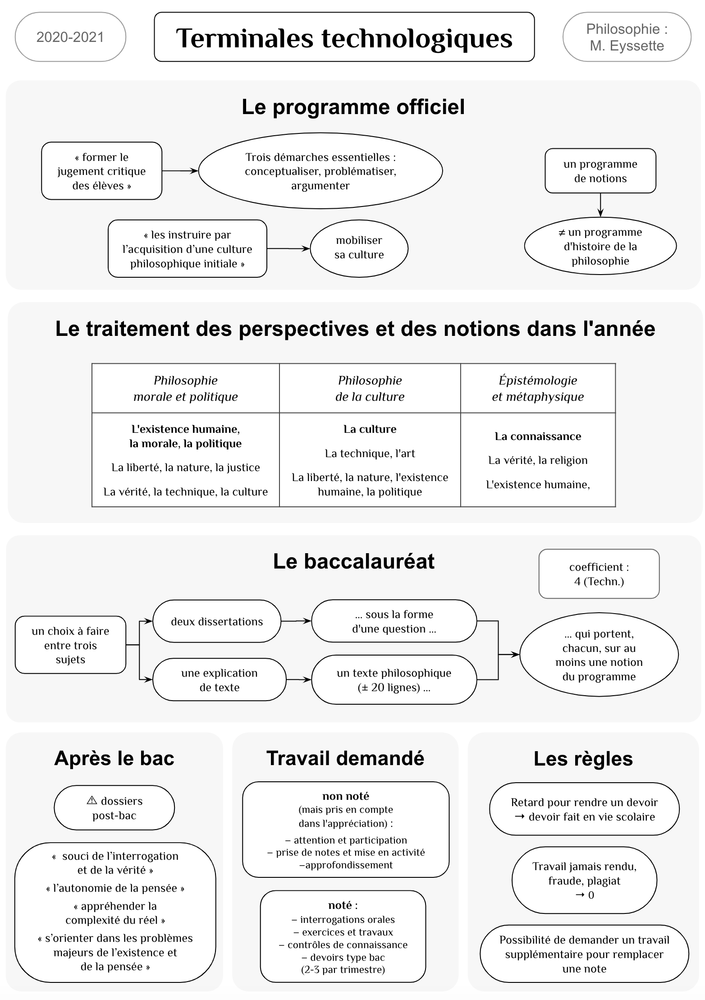
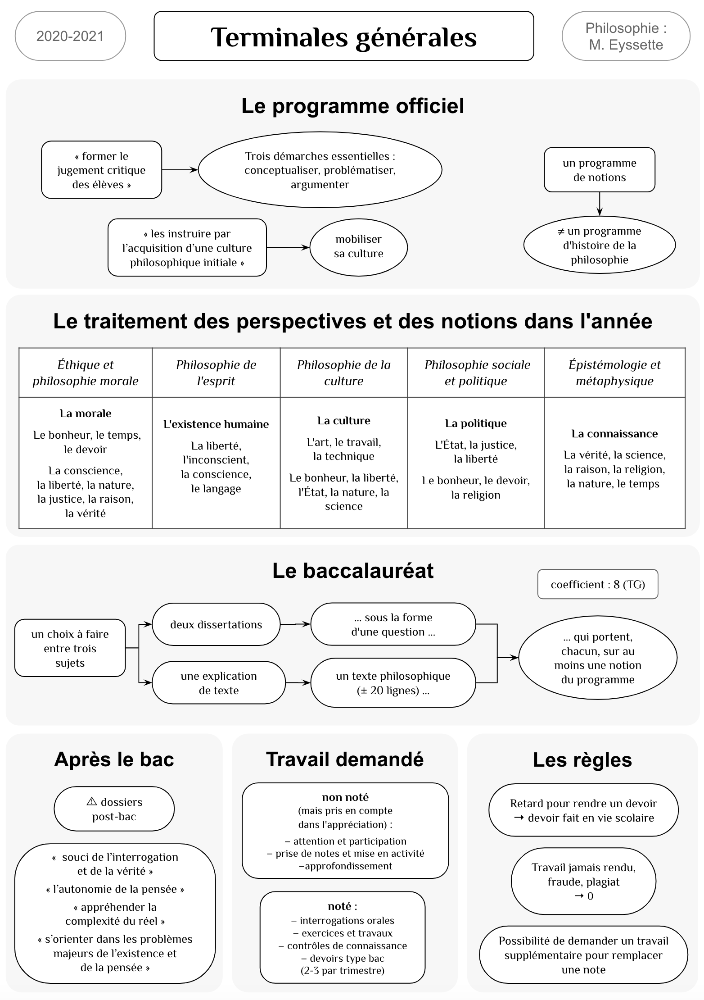

<!-- _class: partie -->
# II – Le  fonctionnement  du cours <!-- fit -->
Deuxième partie

---
<!-- _class: souspartie -->
## A. Le cadre général

---
<!-- _class: i2t1 contain -->

### Syllabus du cours

---
<!-- _class: exercice application -->

### Exercice à faire à la maison

- Pourquoi peut-on dire que réfléchir, comme en philosophie, c'est dire non ?
  - Rédigez un paragraphe (150 mots minimum) sur une feuille à part.
  - Utilisez au moins un élément de ce cours d'introduction à la philosophie.

---
<!-- _class: souspartie -->
##  B. Les aides pour réussir en philosophie

---
<!-- _class: etape -->

### 1. Votre professeur

N'hésitez pas à me poser vos questions, à me partager vos réflexions, vos doutes ! 

Pour discuter avec moi : en direct, ou par l'ENT, ou éventuellement par mail (cedric.eyssette@ac-lyon.fr : faites attention à l'écriture de mon nom, je risque de ne pas recevoir votre mail).

---
<!-- _class: etape fppppppp -->

### 2. Lectures

- *Obligatoires* : textes distribués pour chaque chapitre + une œuvre suivie.
- *Pour approfondir* : manuels et revue [PhiloMag](https://www.philomag.com/) au CDI, conseils de lecture pour chaque chapitre, conseils de lecture sur un thème qui vous intéresse.
- *À éviter* : les annabacs, les livres de méthode.

---
<!-- _class: etape -->

### 3. Internet

- Sur l'[ENT du lycée](https://aiguerande.ent.auvergnerhonealpes.fr/sg.do?PROC=CLASSEUR_PEDA&ACTION=AFFICHER_ELEVES_ACCUEIL_CLASSEUR), dans votre classeur pédagogique, vous retrouverez les diapositives et tous les documents de cours, de la méthodologie et un choix de ressources utiles.
- Voici une [sélection de chaînes vidéo intéressantes](https://eyssette.github.io/ressources-generales-enseignement-philosophie/chaines-video-interessantes)
- Pour faire des recherches sur un sujet philosophique, tous les sites ne sont pas de bonne qualité, utilisez cet outil qui permet de faire une [recherche parmi des sites de philosophie de qualité](https://cse.google.com/cse?cx=005941353090358050370:-rxleq99qm0) que j'ai sélectionnés.

